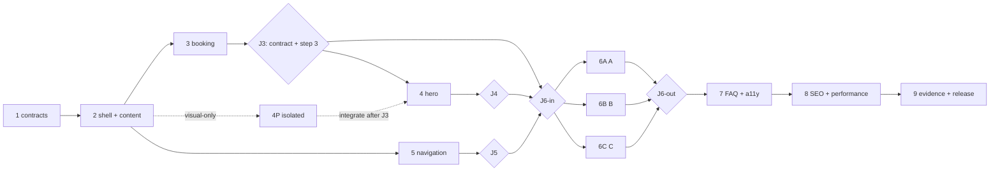

# Parallelization scratchpad — day-use homepage

## Corrected invariants

- Preserve steps 1–9 and their acceptance scope. Scheduling and file ownership may be refined; numbered-step content is not rewritten.
- Exact dependencies: `1: —`, `2: 1`, `3: 1+2`, `4: 2+3`, `5: 2`, `6: 3+4+5`, `7: 3–6`, `8: 6+7`, `9: 1–8`.
- Critical path: `1 → 2 → 3 → 4 → 6 → 7 → 8 → 9`.
- Step 5 has its own J5 and joins only at J6-in. It cannot block step 4.
- J3 accepts step 3 only. J3 cannot pass until either the real Exely single-date contract is confirmed or the owner explicitly approves a concrete fallback decision. “Unresolved” is not an exit state.
- While J3 is blocked externally, the visual-only 4P slice may progress on an isolated branch after J2, but it cannot be integrated or accepted as step 4 until J3 passes.
- J6-in accepts prerequisites 3, 4 and 5; J6-out accepts the outputs of step 6. They are separate recorded joins.
- Maximum three workstreams. Concurrent edits must be file-disjoint and shared files merge through one named owner.

## Workstreams and implementation roles

| Workstream | Role | Primary scope |
|---|---|---|
| A — Frontend/booking + integration | Senior frontend engineer and booking-state owner | Intro shell, all step-3 production, hero, `page.tsx`, PriceList, common CSS/layout and release-source integration |
| B — Content+i18n+SEO + navigation | React-capable content systems/i18n/technical SEO engineer | Translations/content, navigation/Header, editorial experience sections, metadata, schema and AGENTS documentation |
| C — A11y frontend + QA | Accessibility-focused frontend/test engineer | Step-3 tests/a11y verification, accessible final CTA/FAQ surfaces, cross-cutting tests, E2E, axe/Lighthouse and evidence |

## Exact file ownership

### A — production and integration owner

- Shared shell: `src/app/globals.css`, `src/app/[locale]/layout.tsx`, `src/app/[locale]/page.tsx`.
- Step 3 production: `src/lib/day-use-booking.ts`, `src/components/sections/DayUseBooking.tsx`, `src/components/sections/BookingWidget.tsx`, `src/components/ui/DatePicker.tsx`, `src/components/ui/GuestSelect.tsx`.
- Hero/media: `src/components/sections/Hero.tsx`, `src/components/sections/HeroSlideshow.tsx`, `src/components/effects/SnowParticles.tsx`.
- Step 6 A slice: `src/components/sections/PriceList.tsx`; A integrates all step-6 components into `page.tsx`. `MapBlock.tsx` remains read-only.

### B — content, navigation and SEO owner

- `src/content/translations.ts`, `src/content/home-day-use.ts`, `src/content/navigation.ts`.
- Step 5: `src/components/layout/Header.tsx`, `src/components/layout/__tests__/Header.test.tsx`, removal of `src/components/ui/SeasonToggle.tsx` and its test.
- Step 6 B slice: `src/components/sections/DayJourney.tsx`, `src/components/sections/LeisureShowcase.tsx`, `src/components/sections/BentoGallery.tsx`.
- FAQ/SEO: `src/content/faq.ts`, `src/content/assistant-knowledge.ts`, `src/content/seo.ts`, `src/components/seo/JsonLd.tsx`.
- Step 9 documentation: `AGENTS.md`.

### C — test/a11y and accessible surface owner

- Step 3 tests: `src/lib/__tests__/day-use-booking.test.ts`, `src/components/sections/__tests__/DayUseBooking.test.tsx`, `src/components/sections/__tests__/BookingWidget.test.tsx`, `src/components/ui/__tests__/DatePicker.test.tsx`, `src/components/ui/__tests__/GuestSelect.test.tsx`.
- Step 6 C slice: `src/components/sections/FinalBookingCta.tsx`; `MapBlock.tsx` is validated read-only.
- Step 7: `src/components/ui/FaqPanel.tsx`, `src/components/layout/StickyBookingCta.tsx`, `src/components/ui/__tests__/FaqPanel.test.tsx`.
- Cross-cutting verification: `tests/e2e/responsive.spec.ts`, `tests/e2e/qa-audit.spec.ts` and the AC evidence pack.

`package.json` and `playwright.config.ts` remain read-only unless C raises a separately reviewed change. A owns every edit to `globals.css`, `layout.tsx` and `page.tsx`; B/C hand off requirements. Production defects discovered by C return to the production-file owner.

## Corrected waves and joins

1. **Wave 0 — step 1.** C captures baseline/preview evidence, A inspects shell/Exely loader, B verifies facts/photos/sources. No source edits. **J1:** product truth is recorded and the Exely state is recorded as confirmed, fallback-required or unresolved. An unresolved Exely state may permit Wave 1 and isolated visual work, but not J3.
2. **Wave 1 — step 2.** A performs `2A` intro removal in layout/CSS/component; B performs `2B` RU/UZ/EN plus `home-day-use.ts`; C prepares read-only assertions. **J2:** no hidden shell/intro references, locale keys compile, approved asset keys resolve and typecheck passes.
3. **Wave 2 — step 3 and step 5 concurrently.** A implements all step-3 production files; C writes its exact tests and performs a11y verification. Independently, B completes step 5 in navigation/Header/Season files and records **J5**. A may prepare visual-only `4P` after J2 on an isolated branch while Exely is unresolved. **J3 (step 3 only):** all step-3 tests pass and the Exely single-date query/field names are confirmed in preview **or** the owner has approved a concrete fallback behavior. Unknown/unresolved contract means J3 fails. **J5:** locale fragments, secondary-page links, mobile Header behavior, and absence of `/nomera`/manual season pass; J5 is not required for step 4.
4. **Wave 3 — step 4 after J3.** A integrates the accepted booking contract and any isolated 4P work into the hero. B checks locale content/length; C verifies keyboard, reduced motion and viewports. **J4:** first-screen criteria pass at 390×844 and 1440×900, 320/430 have no overflow, and one LCP candidate is accepted.
5. **J6-in.** Record only when J3, J4 and J5 have all passed. This join authorizes step 6; it does not claim any step-6 output.
6. **Wave 4 — step 6, three disjoint production slices.** After a shared interface/section-id contract is frozen: A owns `6A` (`src/app/[locale]/page.tsx`, `src/components/sections/PriceList.tsx`, integration and read-only `src/components/sections/MapBlock.tsx` mount); B owns `6B` (`src/components/sections/DayJourney.tsx`, `src/components/sections/LeisureShowcase.tsx`, `src/components/sections/BentoGallery.tsx`); C owns `6C` (`src/components/sections/FinalBookingCta.tsx` plus accessible behavior and read-only MapBlock fallback verification). B/C hand completed components to A; only A edits `page.tsx`. **J6-out:** all three slices are integrated; exactly seven blocks, correct order/anchors, source-truth prices/map fallback and shared booking state pass. J6-out, not J6-in, authorizes step 7.
7. **Wave 5 — step 7.** B edits FAQ content/data (`7A`), C edits FaqPanel/Sticky/tests (`7B`), A applies collision/safe-area CSS (`7C`). Regressions in Header route to B; DatePicker/GuestSelect regressions route to A. **J7:** one public day-use FAQ source, no overnight copy, and the open-state × viewport/focus matrix pass.
8. **Wave 6 — step 8.** B owns SEO/schema plus its existing `DayJourney`/`BentoGallery` performance edits (`8A`); A owns `layout.tsx`, HeroSlideshow and `globals.css` integration (`8B`); C owns rendered HTML/schema/network/Lighthouse/axe verification (`8C`). **J8:** locale metadata parity, one H1, canonical/alternates, schema validator and agreed performance/a11y budgets pass.
9. **Wave 7 — step 9.** C owns E2E/evidence (`9A`), B owns approvals/AGENTS/release notes (`9B`), A owns source-fix routing, exact release commit and rollback (`9C`). **J9:** steps 1–8 accepted, gates and A1–A4 are recorded, Exely/test-delivery evidence exists, no overnight promotion remains and merge is explicitly approved.

## L-step split map

- Step 2: `2A shell intro` / `2B i18n content`.
- Step 3: `3A pure contract+CTA production` / `3B selector production` (both A, sequential where shared) / `3C tests+a11y` (C, file-disjoint).
- Step 6: `6A composition+PriceList` (A) / `6B editorial sections` (B) / `6C final CTA+a11y` (C), concurrently after J6-in.
- Step 7: `7A FAQ content` (B) / `7B interaction+tests` (C) / `7C shared CSS integration` (A).
- Step 8: `8A SEO/editorial media` (B) / `8B shell/hero performance` (A) / `8C preview budgets` (C).
- Step 9: `9A automation/evidence` (C) / `9B approvals/docs` (B) / `9C release/rollback` (A).

## Dependency graph

## Execution directive

Parallel work **MUST** use disjoint files. Every shared file has one named merge owner. Other streams hand off requirements, review comments or a minimal patch proposal and never edit the file concurrently. When overlap is discovered, the later edit stops and routes to the owner before work resumes. Each join is recorded separately in the PR/evidence log; J3, J5, J4, J6-in and J6-out are not interchangeable.

New photography remains a separate content follow-up and approved existing `gal*` assets remain the release baseline. Analytics starts only after provider and PII-safe schema approval; it remains outside the critical path and uses the documented AC-28 deviation/follow-up when unavailable.
