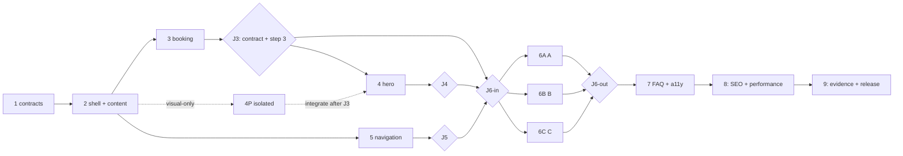

## Initial User Prompt

теперь твоя задача подготовить полную документацию для задачи проекта

## Description

### Бизнес-контекст

Текущая главная страница одновременно использует сигналы дневной площадки, классического отеля и сезонного развлекательного проекта. Поля «заезд/выезд», публичные ссылки на номера, заставка перед контентом и переключатель сезона создают неверные ожидания и задерживают путь к основному действию. Фактический продукт CHIMGAN DARBAZA сейчас — дневной отдых с 08:00 до 18:00: гости арендуют топчан с курпачой вместимостью до восьми человек, готовят на мангале или в казане, заказывают еду и проводят день в горах. Ночёвки, глэмпинг и коттеджи остаются на паузе.

Нужно создать более короткую, мобильную в первую очередь главную страницу в направлении **«современная узбекская горная дача»**. Визуальная история должна опираться на настоящие фотографии CHIMGAN DARBAZA, топчаны, курпачи, огонь, еду, людей и горный пейзаж. Страница должна без задержки объяснять дневной формат, показывать актуальные цены и условия и вести гостя к запросу на бронирование топчана по одной дате. Это должно увеличить долю квалифицированных обращений и сократить вопросы оператору, вызванные неверным ожиданием ночёвки или мгновенного онлайн-подтверждения.

### Бизнес-цели и измеримые результаты

- Устранить блокирующую заставку: контент и основное действие доступны сразу после загрузки.
- Устранить публичное продвижение ночёвок: на главной, в доступных с неё шапке и футере нет секций или ссылок на номера, глэмпинг, коттеджи и ночной заезд.
- Сделать путь к обращению однодневным: 100% корректных переходов с формы на главной передают выбранную дату и количество гостей в форму запроса.
- Ограничить повествование: после hero-секции размещается не более семи основных контентных секций.
- Обеспечить полное смысловое соответствие русской, узбекской и английской версий без случайного смешения языков.
- Исключить пересечение плавающей кнопки FAQ с видимыми полями и CTA бронирования на целевых мобильных размерах.
- Дать возможность измерять начало и успешное завершение воронки запроса без передачи персональных данных в аналитику.

### Заинтересованные стороны

- **Основные пользователи**: семьи, компании друзей и организаторы групп, планирующие дневную поездку из Ташкента; в особенности мобильные пользователи.
- **Операционная команда**: администратор и менеджер бронирований, которым нужны корректные дата и размер группы в обращении.
- **Владелец и маркетинг**: отвечают за достоверность предложения, цены, визуальный образ и конверсию.
- **Контент и локализация**: отвечают за равнозначные RU/UZ/EN тексты, реальные фотографии и alt-тексты.
- **Будущий продукт размещения**: материалы глэмпинга и коттеджей должны сохраниться для повторного запуска, но не рекламироваться сейчас.
- **QA и специалисты по доступности**: подтверждают работу на целевых устройствах, с клавиатурой, скринридером и reduced motion.

### Объём задачи

**Входит в задачу**:

- редизайн главной страницы и общих элементов навигации, которые видны на ней;
- hero с ясным предложением дневного отдыха, ключевыми фактами и формой запроса;
- один выбор даты посещения и выбор 1–8 гостей вместо «заезда/выезда»;
- передача этих значений в существующую форму запроса и сохранение действующего операционного маршрута бронирования;
- компактная структура: цены и состав предложения, сценарий дня, еда и атмосфера, дорога, доверие/отзывы, FAQ и финальный CTA;
- удаление блокирующей заставки и гостевого переключателя «лето/зима»;
- удаление публичных ссылок и сообщений о ночёвках без удаления сохранённых материалов размещения;
- настоящие фотографии площадки и единое спокойное визуальное направление с тёмно-зелёным, тёплым молочным и золотым акцентом;
- равнозначные RU/UZ/EN версии, адаптивность, доступность, производительность, SEO и анонимное измерение воронки;
- устойчивые состояния при ошибке изображения, карты, параметров запроса или отсутствии ответа в FAQ.

**Не входит в задачу**:

- открытие, удаление или полный редизайн сохранённых страниц глэмпинга/коттеджей;
- внедрение или настройка Exely, живая проверка наличия мест, мгновенное подтверждение, онлайн-оплата, отмена и процессы ночного заселения;
- изменение Telegram/email-провайдеров, адресов маршрутизации и бизнес-процесса ручного ответа;
- добавление базы данных, CMS, авторизации или личного кабинета;
- организация новой фотосъёмки, генерация искусственных изображений объекта или показ несуществующей инфраструктуры;
- полный ребрендинг, переписывание юридических документов, редизайн несвязанных внутренних страниц, DNS или инфраструктурные работы.

### Пользовательские сценарии

1. **Основной запрос**: гость открывает локализованную главную, сразу понимает дневной формат, выбирает будущую дату и 1–8 гостей, нажимает CTA запроса топчана и видит оба значения в форме бронирования.
2. **Сначала цены**: гость сравнивает утверждённые цены Пн–Чт и Пт–Вс, изучает включённые и дополнительные услуги, затем начинает тот же запрос.
3. **Знакомство с опытом**: гость просматривает последовательность дня, еду, огонь, людей и горы и доходит до финального CTA без сообщений о ночёвке.
4. **FAQ и контакт**: гость ищет ответ в FAQ; если ответа нет, получает локализованный путь к контакту, при этом плавающий элемент не перекрывает бронирование.
5. **Как добраться**: при рабочей карте гость открывает маршрут; при ошибке карты всё равно видит адрес, часы, телефон и внешнюю ссылку на маршрут.
6. **Ошибка данных**: пустая/прошедшая дата или недопустимое число гостей не отправляются, а соответствующее поле получает понятную локализованную ошибку без потери остальных корректных значений.
7. **Локализация**: на RU, UZ и EN гость получает одинаковый набор фактов, цен, действий, ошибок и доступных разделов на выбранном языке.
8. **Доступный режим**: пользователь клавиатуры, скринридера или reduced motion проходит основную воронку без потери фокуса, принудительной анимации и скрытых контролов.

### Предположения и ограничения

- На момент релиза дневной режим работает ежедневно 08:00–18:00; объект находится в 45 минутах от Ташкента на высоте 1700 м; один топчан рассчитан максимум на восемь гостей.
- Выбранная дата является датой запроса, а не подтверждённой доступностью. Тексты не обещают мгновенное подтверждение или фиксированное время ответа.
- Топчан — единственный подтверждённый формат, который нужно запрашивать с главной; поэтому форма содержит ровно два видимых селектора: дату и гостей.
- Утверждённые владельцем данные о ценах, включённых услугах, контактах и часах являются источником истины на момент релиза.
- Автоматическое сезонное оформление допускается, но информационная архитектура и бронирование остаются одинаковыми круглый год.
- Используются только предоставленные и одобренные реальные изображения площадки с правом публикации.

### Зависимости

- утверждение владельцем цен, формулировок, контактных данных и фактов о площадке;
- проверенные переводы RU/UZ/EN с одинаковым смыслом;
- набор одобренных реальных фотографий и локализованных alt-текстов;
- работоспособная существующая форма запроса и настроенные каналы уведомлений;
- актуальная внешняя ссылка на маршрут, адрес, график и телефон для резервного состояния карты;
- среда аналитики для анонимных событий начала и успешного завершения запроса.

### Открытые вопросы

Блокирующих вопросов для планирования нет. Окончательные тексты, переводы, цены и выбранные фотографии требуют явного одобрения владельца до публикации.

---

## Acceptance Criteria

### Функциональные требования

- [ ] **AC-01 — Мгновенный доступ к странице**
  - **Given**: пользователь впервые открывает любую локализованную главную страницу.
  - **When**: начинается загрузка страницы.
  - **Then**: страница не показывает полноэкранную заставку, модальный intro, кнопку «Пропустить», таймер или блокировку прокрутки; hero и его действия доступны сразу.

- [ ] **AC-02 — Достоверное предложение в hero**
  - **Given**: открыта главная на RU, UZ или EN.
  - **When**: отображается hero.
  - **Then**: видны бренд CHIMGAN DARBAZA, явная формулировка дневного отдыха, часы 08:00–18:00, вместимость топчана до восьми гостей и основной CTA запроса топчана; hero не называет продукт номером, отелем или ночёвкой.

- [ ] **AC-03 — Основное действие в первом экране**
  - **Given**: главная открыта без прокрутки при viewport 390×844 или 1440×900 CSS px.
  - **When**: завершён первичный рендер.
  - **Then**: пользователь видит позиционирование, селекторы даты и гостей и активный CTA целиком, без перекрытия шапкой, FAQ или другим плавающим элементом.

- [ ] **AC-04 — Поля дневного запроса**
  - **Given**: пользователь находится в форме hero.
  - **When**: он просматривает доступные поля.
  - **Then**: форма содержит ровно два видимых селектора — «Дата отдыха/посещения» и «Гости» — и CTA «Забронировать/Запросить топчан» в локализованной формулировке; полей «заезд», «выезд», «ночей» или «номер» нет.

- [ ] **AC-05 — Выбор и проверка даты**
  - **Given**: пользователь открывает выбор даты.
  - **When**: он выбирает сегодня или будущую дату и продолжает.
  - **Then**: дата принимается в однозначном локализованном отображении; прошедшие даты недоступны, а пустая/некорректная дата блокирует переход и показывает связанную с полем локализованную ошибку.

- [ ] **AC-06 — Выбор и проверка гостей**
  - **Given**: пользователь открывает выбор гостей.
  - **When**: он выбирает значение.
  - **Then**: доступны только целые значения 1–8; пустое или иное значение блокирует переход и показывает связанную локализованную ошибку, а для группы более восьми доступен путь к прямому контакту.

- [ ] **AC-07 — Передача данных в запрос**
  - **Given**: выбраны корректная дата и 1–8 гостей.
  - **When**: пользователь нажимает основной CTA hero или CTA из ценового блока, сохранив те же значения.
  - **Then**: открывается локализованный путь формы запроса, где выбранные дата и количество гостей уже заполнены и совпадают с исходными значениями.

- [ ] **AC-08 — Семантика и доставка запроса**
  - **Given**: пользователь завершает валидную форму запроса, а тестовые каналы уведомлений настроены.
  - **When**: запрос отправлен.
  - **Then**: интерфейс называет действие запросом, а не подтверждённой бронью; пользователь получает локализованное состояние успешной отправки, а оператор — обращение категории `booking` с датой и числом гостей через существующую маршрутизацию без регрессии.

- [ ] **AC-09 — Короткая и последовательная главная**
  - **Given**: загружена полная главная страница.
  - **When**: QA считает основные секции после hero по визуально различимым смысловым блокам.
  - **Then**: их не более семи и они следуют логике: цены/состав предложения → сценарий дня → еда и атмосфера → как добраться → доверие/отзывы → FAQ → финальный CTA; дублирующих каталогов, галерей или промо-блоков без нового смысла нет.

- [ ] **AC-10 — Цены и условия дневного отдыха**
  - **Given**: владелец утвердил актуальный прайс.
  - **When**: пользователь открывает ценовой блок в любой локали.
  - **Then**: видны раздельные значения Пн–Чт и Пт–Вс, валюта UZS/сум, вместимость топчана и актуальные позиции въезда, топчана, мангала, казана, дров/угля и кухни только в той мере, в которой они присутствуют в утверждённом источнике; все суммы и подписи совпадают с ним.

- [ ] **AC-11 — Аутентичная визуальная история**
  - **Given**: просмотрены hero и контентные изображения главной.
  - **When**: проводится контент-аудит.
  - **Then**: используются только одобренные реальные фотографии CHIMGAN DARBAZA и представлены как минимум четыре категории: топчан/курпача, огонь или готовка на мангале/в казане, люди или совместная еда, горная панорама; нет стоковых, AI-сгенерированных или вводящих в заблуждение изображений объекта.

- [ ] **AC-12 — Ночёвки не рекламируются**
  - **Given**: пользователь просматривает главную, раскрывает desktop/mobile навигацию и футер.
  - **When**: он проверяет все публичные ссылки и сообщения этих поверхностей.
  - **Then**: отсутствуют карточки, CTA и ссылки на `/nomera`, глэмпинг, коттеджи, ночной заезд, выезд, бассейн или другую неподтверждённую инфраструктуру; сохранённые материалы размещения при этом не удаляются.

- [ ] **AC-13 — Навигация соответствует дневному продукту**
  - **Given**: открыта шапка или мобильное меню в любой локали.
  - **When**: пользователь просматривает основные пункты.
  - **Then**: доступны смысловые эквиваленты «Цены», «Топчаны», «Меню», «Что рядом», «Как добраться», «Контакты» и основной CTA; каждый пункт ведёт на существующую локализованную страницу или корректный якорь без 404 и пустой цели.

- [ ] **AC-14 — Нет гостевого переключателя сезона**
  - **Given**: пользователь просматривает главную, desktop/mobile шапку и меню.
  - **When**: интерфейс загружен в любой календарный сезон.
  - **Then**: в нём нет управления «Лето/Зима» или его эквивалента; автоматические сезонные изображения/декор не меняют структуру, факты и путь запроса.

- [ ] **AC-15 — FAQ не перекрывает бронирование**
  - **Given**: ширина viewport равна 320, 390 или 430 CSS px и плавающий FAQ закрыт.
  - **When**: на экране виден любой селектор или CTA бронирования.
  - **Then**: кнопка FAQ скрыта либо отделена от каждого контрола минимум на 8 CSS px и не перехватывает его pointer/focus-область; при открытии панели есть видимое доступное закрытие и возврат фокуса к кнопке запуска.

- [ ] **AC-16 — FAQ отражает текущий продукт**
  - **Given**: пользователь открывает или ищет FAQ в любой локали.
  - **When**: отображаются результаты.
  - **Then**: вопросы покрывают дневной график, цены/топчан, гостей, готовку/еду, дорогу и контакт; публично не выводятся темы ночёвки, cottage/glamping, check-in, отмены проживания, бассейна и обещание ответа за 15 минут; отсутствие результата показывает локализованный контактный fallback.

- [ ] **AC-17 — Дорога и контакты устойчивы к ошибке карты**
  - **Given**: загружен блок «Как добраться».
  - **When**: карта работает или её загрузка заблокирована/завершается ошибкой.
  - **Then**: в обоих случаях остаются видимы адрес, «45 минут от Ташкента», график 08:00–18:00, телефон и рабочая внешняя ссылка на маршрут; ошибка карты не блокирует CTA и не оставляет пустую секцию.

- [ ] **AC-18 — Финальная точка конверсии**
  - **Given**: пользователь дошёл до конца основных секций.
  - **When**: отображается финальный CTA.
  - **Then**: CTA повторяет запрос топчана/дневного отдыха, ведёт на локализованную форму и не обещает мгновенную доступность, оплату или подтверждение.

- [ ] **AC-19 — Полный паритет RU/UZ/EN**
  - **Given**: один и тот же сценарий выполняется на `/ru`, `/uz` и `/en`.
  - **When**: проверяются hero, навигация, цены, форма, ошибки, alt-тексты, FAQ, дорога и CTA.
  - **Then**: весь пользовательский текст находится на выбранном языке, смысл и набор фактов/действий совпадают, отсутствуют технические ключи и непреднамеренный русский fallback в UZ/EN.

- [ ] **AC-20 — Достоверность бизнес-фактов**
  - **Given**: доступны утверждённые владельцем источники контента.
  - **When**: проводится сверка всех фактических утверждений главной.
  - **Then**: график, высота, время в пути, вместимость, цены, контакты и состав услуг совпадают с источниками; отсутствуют неподтверждённые обещания, абсолютные маркетинговые утверждения и фиксированный срок ответа.

- [ ] **AC-21 — Безопасные состояния ошибок и медленной загрузки**
  - **Given**: hero/контентное изображение загружается медленно или с ошибкой, либо форма запроса получает отсутствующие/некорректные параметры.
  - **When**: страница рендерится в таком состоянии.
  - **Then**: текст, цены, адрес и CTA остаются читаемыми и интерактивными, зарезервированные области не вызывают заметного скачка макета, а некорректные параметры сбрасываются в безопасные пустые/валидные значения с возможностью продолжить.

### Нефункциональные требования

- [ ] **AC-22 — Адаптивность без пересечений**
  - **Given**: страница проверяется при ширине 320, 390, 768, 1024 и 1440 CSS px.
  - **When**: пользователь проходит страницу и открывает интерактивные элементы.
  - **Then**: отсутствуют горизонтальная прокрутка страницы, обрезанный текст, наложение контролов и недоступные за краем viewport действия; порядок контента и приоритет основного CTA сохраняются.

- [ ] **AC-23 — Клавиатура, семантика и скринридер**
  - **Given**: пользователь не использует мышь.
  - **When**: он проходит шапку, hero-форму, навигацию, FAQ и финальный CTA клавишами Tab, Shift+Tab, Enter, Space и Escape там, где применимо.
  - **Then**: фокус видим, логичен и не запирается; все действия доступны; есть один содержательный H1, последовательные заголовки, программные labels, описанные ошибки, alt-тексты и объявления динамических состояний.

- [ ] **AC-24 — Контраст и сенсорные цели**
  - **Given**: проводится автоматический и ручной аудит WCAG 2.2 AA.
  - **When**: проверяются обычные, hover, focus, disabled и error состояния.
  - **Then**: обычный текст имеет контраст не ниже 4.5:1, крупный текст и графические/интерактивные элементы — не ниже 3:1, смысл не передаётся только цветом, а основные touch targets имеют размер не менее 44×44 CSS px.

- [ ] **AC-25 — Reduced motion**
  - **Given**: включён `prefers-reduced-motion: reduce`.
  - **When**: пользователь загружает и прокручивает главную.
  - **Then**: автопрокрутка, параллакс, снег/частицы, масштабирование и необязательные переходы отключены либо сведены к мгновенной смене состояния; контент не скрыт до анимации и функциональность не теряется.

- [ ] **AC-26 — Производительность**
  - **Given**: production-сборка проверяется в Chrome Lighthouse с мобильными настройками по умолчанию без расширений.
  - **When**: выполнены три последовательных запуска на локализованной главной и взята медиана.
  - **Then**: Performance ≥90, Accessibility ≥95, LCP ≤2.5 с и CLS ≤0.10; hero-изображение не ждёт завершения intro-анимации, а декоративные медиа не блокируют основной контент.

- [ ] **AC-27 — SEO и локализованная индексация**
  - **Given**: поисковый робот открывает каждую локализованную главную.
  - **When**: анализируются отрендеренный HTML и метаданные.
  - **Then**: страница индексируема, имеет один релевантный H1, корректные локализованные title/description, canonical и RU/UZ/EN alternate-ссылки; структурированные данные содержат только видимый актуальный day-use контент и проходят валидатор без критических ошибок.

- [ ] **AC-28 — Аналитика без персональных данных**
  - **Given**: аналитика разрешена и пользователь начинает либо успешно завершает запрос с главной.
  - **When**: событие попадает в тестовый поток аналитики.
  - **Then**: различимы события начала и успешного завершения с локалью и безопасным источником CTA; имя, телефон, сообщение, точная дата и иные значения формы не передаются.

- [ ] **AC-29 — Совместимость и отсутствие регрессий**
  - **Given**: production-сборка открыта в двух последних стабильных версиях Chrome, Safari, Firefox и Edge на доступных desktop/mobile платформах.
  - **When**: выполняются основной запрос, переключение локали, навигация, FAQ, контакты и маршрут.
  - **Then**: сценарии дают эквивалентный результат без критических визуальных или функциональных ошибок; существующие формы `booking` и `inquiry` сохраняют раздельную маршрутизацию, а скрытые материалы ночёвок остаются в проекте для будущего возврата.

### Definition of Done

- [ ] Все AC-01–AC-29 пройдены на RU, UZ и EN; отклонения задокументированы и одобрены владельцем до релиза.
- [ ] Владелец письменно утвердил финальные цены, факты, CTA, переводы и выбранные реальные фотографии.
- [ ] Автоматические тесты обновлены для формы одной даты, передачи параметров, локалей, навигации, FAQ и маршрутизации обращений; весь набор тестов проходит.
- [ ] Проведены ручные проверки целевых viewport, клавиатуры, скринридера/reduced motion, ошибки карты и ошибки изображений.
- [ ] Зафиксированы результаты Lighthouse, WCAG-аудита, проверки ссылок, SEO-метаданных и структурированных данных.
- [ ] Тестовый поток аналитики подтверждает оба события и отсутствие персональных полей.
- [ ] TypeScript-проверка, lint, production build и тесты завершаются без новых ошибок.
- [ ] Код и контент прошли review; в документации отмечено, что ночёвки скрыты, но не удалены, а Exely не входит в этот релиз.

---

## Architecture Overview

Архитектурные решения опираются на [исследование](../../research/day-use-homepage-redesign.md) и [карту влияния на код](../../analysis/day-use-homepage-codebase.md). `AGENTS.md` считается источником истины о текущем бизнес-продукте: дневной отдых доступен, ночное размещение приостановлено.

### Стратегия решения

Редизайн меняет не технологический стек, а приоритеты и контракты публичного интерфейса. Существующие Next.js App Router, локали, Tailwind-токены, `DatePicker`, `GuestSelect`, серверные actions и каналы уведомлений сохраняются. Ночные страницы, данные комнат, FAQ-записи и Exely-идентификаторы не удаляются; они исключаются из публичного пути до решения владельца.

### Дизайн-тезисы

- **Визуальный тезис**: «современная узбекская горная дача» — реальные фотографии, топчан, курпача, огонь, еда и горы; тёмно-зелёный, тёплый молочный и один золотой акцент.
- **Контентный тезис**: каждая секция отвечает на один вопрос гостя и не повторяет соседнюю.
- **Интеракционный тезис**: одинаковая короткая entrance-анимация, один сдержанный scroll-depth эффект и ясные hover/focus-состояния; без заставки, неостанавливаемых марки и ручного сезонного переключателя.

### Целевая информационная архитектура

После hero остаётся не более семи секций:

1. **Цены и состав** — что можно арендовать, разница будней/выходных, что входит.
2. **Сценарий дня** — приезд, топчан, еда/огонь, отдых и виды.
3. **Еда и атмосфера** — кухня, мангал, казан и свои продукты.
4. **Как добраться** — 45 минут от Ташкента, карта, адрес, часы и контакт.
5. **Доверие** — только проверяемые отзывы и реальные фотографии.
6. **FAQ** — курированные вопросы о дневном отдыхе.
7. **Финальный CTA** — повтор запроса топчана без обещания мгновенного подтверждения.

Длинные showroom-галереи, каталог номеров, master plan и дублирующие promo-блоки исключаются из композиции главной, но их исходный контент сохраняется.

### Контракты бронирования и Exely

- Публичный day-use UI показывает «Дату отдыха» и «Гостей», но для безопасной миграции сохраняет существующие query-ключи `checkin` и `guests`; `checkin` имеет ISO-формат `YYYY-MM-DD`, `guests` — целое число 1–8. Новые ключи `date` и `product` не вводятся без отдельного migration plan.
- Граница `/[locale]/bron` сохраняется как активный Exely host. Главная не передаёт фиктивный `checkout`; `room-type=5075762` добавляется лишь после contract test с Exely.
- Текущие Exely context, `#be-booking-form`, загрузчик `/bron` и `EXELY_ROOM_TYPE.day = 5075762` сохраняются. Интеграция получает только поля, подтверждённые её документированным контрактом.
- До подтверждения single-date контракта Exely сайт сохраняет текущее failure-состояние `BookingEngineSlot` с прямыми контактами. Предзаполненный server-action fallback не обещается без расширения scope на `bron/page.tsx`, форму и её тесты.
- `booking` и `inquiry` остаются разными видами email-обращений. Текущая email-маршрутизация не меняется; возврат Telegram или иного канала является отдельной операционной задачей.

Перед разработкой нужно проверить точный Exely query-контракт для дневного room type. Это не блокирует визуальную часть, но блокирует автоматическую передачу одной даты в виджет.

### Границы компонентов и контента

- `page.tsx` задаёт только порядок секций; бизнес-тексты не дублируются в JSX.
- Общие UI-строки живут в `translations.ts` и всегда добавляются атомарно в RU/UZ/EN; предметный контент хранится как `LocalizedString` в соответствующем content-модуле.
- Секция с непростой логикой или повторным использованием выносится в `components/sections`; одноразовая простая композиция может остаться в `page.tsx`.
- FAQ сохраняет статический поиск. Меняются курированный порядок, тексты и позиционирование, а не алгоритм.
- Навигация использует `localizePath` для pathname, а fragment добавляет после локализации: `${localizePath(locale, "/")}#prices`, а не `localizePath(locale, "#prices")`. Это даёт `/${locale}#prices` как с главной, так и со вторичной страницы. Header не пытается отмечать active fragment по `pathname`; якоря имеют стабильные ASCII-id и `scroll-margin-top`.
- JSON-LD на главной не описывает сайт как `LodgingBusiness`/glamping. Базовый вариант — `LocalBusiness` только с видимыми фактами: name, URL, address, coordinates, phone и opening hours. Если SEO-review не подтвердит корректный тип, спорный schema-блок удаляется вместо сохранения ложной семантики.

### Доступность, motion и изображения

- Все поля, dropdown и accordion должны иметь клавиатурный контракт, видимый focus, label, связанные ошибки и возврат фокуса.
- `DatePicker.tsx` и `GuestSelect.tsx` входят в обязательный a11y-контур: для них добавляются documented dialog/grid/listbox semantics, клавиатурная навигация, Escape, initial/return focus и тесты. Если полный APG-контракт не входит в срок релиза, критерии AC-23–AC-24 не могут считаться выполненными.
- На 320–430 px FAQ, sticky CTA и hero-контролы не могут перекрывать pointer/focus-области. У фиксированных элементов должен быть один владелец мобильной safe area.
- Вся несущественная анимация отключается при `prefers-reduced-motion`; контент не зависит от IntersectionObserver для видимости.
- Автодвижение имеет pause/stop; carousel не является единственным способом доступа к контенту.
- Контентные фотографии по возможности рендерятся через `next/image` с заданными `sizes`, dimensions, responsive-источниками и alt. CSS background остаётся только для декоративных изображений.
- Hero имеет один явный LCP-кандидат. Медиа ниже fold загружаются лениво; размеры резервируются до загрузки.

### Ожидаемые изменения

**Обязательный контур:**

- Изменить: `src/app/[locale]/page.tsx`, `src/app/[locale]/layout.tsx`, `src/app/globals.css`, `src/components/layout/Header.tsx`, `src/components/sections/Hero.tsx`, `src/components/sections/BookingWidget.tsx`, `src/components/ui/FaqPanel.tsx`, `src/components/ui/DatePicker.tsx`, `src/components/ui/GuestSelect.tsx`, `src/content/translations.ts`, `src/content/navigation.ts`, `src/content/assistant-knowledge.ts`, `src/content/seo.ts`.
- Обновить тесты: `src/components/sections/__tests__/BookingWidget.test.tsx`, `src/components/layout/__tests__/Header.test.tsx`, `tests/e2e/responsive.spec.ts`, `tests/e2e/qa-audit.spec.ts`.
- Удалить: `src/components/ui/LogoIntro.tsx`, а также его import/mount, pre-hydration gate, CSS и неиспользуемые переводы.
- Создать: `src/components/ui/__tests__/FaqPanel.test.tsx`; расширить `src/components/ui/__tests__/DatePicker.test.tsx` и `src/components/ui/__tests__/GuestSelect.test.tsx` для клавиатуры, фокуса и ARIA-состояний.

**Опциональные изменения после оценки сложности:**

- Упростить `HeroSlideshow.tsx`, `SnowParticles.tsx`, `PhotoMarquee.tsx`, `BentoGallery.tsx`, `LeisureShowcase.tsx`, `PriceList.tsx`.
- Удалить мёртвый `SeasonToggle.tsx` и его тест только после удаления всех import.
- Вынести новые `DayJourney.tsx`, `FinalBookingCta.tsx` или `home-day-use.ts`, если без этого `page.tsx` останется перегруженным.
- Добавлять ключи в `images.ts` и менять `pricing.ts` только после передачи и одобрения новых фотографий/цен.

`src/content/rooms.ts`, `src/app/[locale]/nomera/[slug]/page.tsx`, Exely context/IDs и `public/images/resort/**` не удаляются из репозитория.

### Ключевые решения и компромиссы

1. **Скрыть, а не удалить ночёвки.** Это устраняет ложные обещания и сохраняет готовность к запуску.
2. **Одна дата в UI.** Уменьшает трение, но требует адаптера на границе Exely.
3. **Статичный первый кадр.** Один сильный LCP-образ важнее авторотации; слайдшоу можно оставить только при наличии pause/stop и без ухудшения LCP.
4. **Карточки не являются композицией по умолчанию.** Приоритет у медиа-блоков, списков, разделителей и крупной типографики.
5. **Факты важнее атмосферных обещаний.** Цены, часы, вместимость и порядок подтверждения видны до длинной фотоистории.
6. **Аналитика опциональна.** События воронки добавляются только при наличии согласованной схемы без персональных данных; их отсутствие не блокирует релиз.

### Риски, rollout и rollback

| Риск | Снижение |
|---|---|
| Расхождение `AGENTS.md` и текущего master | До кода зафиксировать решение владельца; по умолчанию скрыть ночёвки без удаления. |
| Неверный однодневный Exely query | Сначала contract test и ручная sandbox-проверка; до подтверждения остаётся текущее failure-состояние с прямыми контактами. |
| Частичное удаление intro оставит страницу скрытой | Удалять атомарно: head-script, mount/import, component, CSS gate и tests. |
| FAQ/sticky CTA перекроют форму | Единая mobile safe-area и visual/E2E-проверка 320, 390 и 430 px. |
| Новые фото или шрифты ухудшат LCP/CLS | Не добавлять неодобренные assets; проверять production build и Lighthouse до merge. |
| Одна локаль отстанет по смыслу | Каждый ключ и сценарий проходит RU/UZ/EN review в одном PR. |

Релиз ведётся в feature-ветке. Перед merge в `master` нужны production build, тесты, ручная проверка трёх локалей и одобрение владельца. Rollback выполняется обратным коммитом редизайна; сохранённые ночные модули и Exely-идентификаторы не требуют восстановления данных.

---

## Implementation Process

Ни один шаг ниже не крупнее **L**: S — до половины инженерного дня, M — около одного дня, L — два–три дня вместе с тестами. Если во время реализации шаг выходит за L, он останавливается и делится до продолжения. Новая фотосъёмка и необязательная аналитика намеренно вынесены за критический путь.

### Сводка реализации

| Шаг | Фаза | Результат | Зависимости | Оценка | Критический путь | Риск |
|---:|---|---|---|---|---|---|
| 1 | Preflight/contracts | Подтверждённые бизнес-факты и single-date контракт Exely | — | M | Да | Высокий |
| 2 | Foundational content/state | Удалён intro; создан единый day-use контентный контракт | 1 | L | Да | Высокий |
| 3 | Hero + booking | Валидируемое состояние одной даты/гостей и совместимые CTA | 1, 2 | L | Да | Высокий |
| 4 | Hero + booking | Первый экран в направлении «горная дача» | 2, 3 | M | Да | Средний |
| 5 | Navigation/home IA | Day-use навигация без ручного сезона и `/nomera` | 2 | M | Нет, join перед 6 | Средне-высокий |
| 6 | Navigation/home IA | Главная из не более чем семи последовательных секций | 3, 4, 5 | L | Да | Средний |
| 7 | FAQ/a11y | Day-use FAQ и единая политика фокуса/fixed-controls | 3–6 | L | Да | Высокий |
| 8 | SEO/performance | Согласованные metadata/schema и performance budget | 6, 7 | L | Да | Средне-высокий |
| 9 | Tests/release | Полный evidence pack, approvals, rollout и rollback | 1–8 | L | Да | Средне-высокий |

### Фаза 1 — Preflight и контракты

#### 1. Зафиксировать источник истины и single-date границу Exely

**Цель:** до изменения интерфейса устранить расхождение между `AGENTS.md`, текущим `master` и реальным состоянием Exely, не расширяя задачу до переделки `/bron`.

**Точные файлы:** read-only проверка `AGENTS.md`, `.specs/tasks/draft/redesign-day-use-homepage.feature.md`, `.specs/analysis/day-use-homepage-codebase.md`, `src/content/pricing.ts`, `src/content/contacts.ts`, `src/content/rooms.ts`, `src/content/images.ts`, `src/app/[locale]/layout.tsx`, `src/components/ui/BookingEngineSlot.tsx`; исходный код на этом шаге не меняется.

**Зависимости:** доступ к preview/feature deployment с реальным Exely loader; владелец или уполномоченный менеджер; утверждённые источники цен, контактов и прав на фотографии.

**Результат:** приложенная к PR decision record с day-use статусом, утверждёнными фактами/фото и таблицей поддерживаемых Exely query-параметров (`checkin`, `guests`, условно `room-type`), а также явным решением для неподдерживаемого single-date handoff.

**Подзадачи:**

- [ ] Снять baseline: сохранить результаты typecheck, unit tests и текущие URL/скриншоты `/ru`, `/uz`, `/en`, `/ru/bron` до изменений.
- [ ] Получить письменное подтверждение, что дневной продукт 08:00–18:00 является публичным, а ночёвки нужно скрыть, но не удалить.
- [ ] Сверить с владельцем цены, вместимость до восьми гостей, 45 минут, 1700 м, телефон, адрес, часы и список разрешённых услуг.
- [ ] Утвердить конкретный список уже существующих `gal*`-фотографий и права публикации; отсутствие новой съёмки не считать блокером.
- [ ] В preview проверить, какие параметры Exely фактически читает для day inventory: один `checkin`, `guests`, `room-type=5075762`, back/refresh и смену локали; не подставлять фиктивный `checkout`.
- [ ] Зафиксировать go/no-go: если single-date контракт не подтверждён, продолжить визуальную ветку, но заблокировать закрытие AC-07/AC-08 и production merge до одобренного fallback/отдельного расширения scope.

**Проверяемые критерии успеха:** все факты имеют владельца и источник (AC-10, AC-11, AC-19, AC-20); тестовый переход передаёт только подтверждённые параметры и сохраняет `#be-booking-form`/failure state (AC-07, AC-08, AC-21, AC-29); baseline воспроизводим теми же командами до и после задачи (AC-29).

**Блокеры:** недоступный Exely preview или отсутствие решения владельца о day-use статусе. Это блокеры release, но не макетов и изолированной разработки.

**Риски и снижение:** **высокий** — неподтверждённый query может открыть ночной продукт или потерять дату. Снижение: реальная sandbox/preview проверка, network/URL evidence и запрет на выдуманные `date`, `product` или `checkout`.

**Оценка:** M.

### Фаза 2 — Базовый контент и состояние оболочки

#### 2. Атомарно убрать intro и собрать локализованный day-use source of truth

**Цель:** обеспечить немедленный первый рендер и единый типизированный контент RU/UZ/EN до сборки новых секций.

**Точные файлы:** изменить `src/app/[locale]/layout.tsx`, `src/app/globals.css`, `src/content/translations.ts`; создать `src/content/home-day-use.ts`; удалить `src/components/ui/LogoIntro.tsx`; read-only использовать `src/content/pricing.ts`, `src/content/contacts.ts`, `src/content/services.ts`, `src/content/images.ts`.

**Зависимости:** шаг 1; утверждённые формулировки и список существующих фотографий.

**Результат:** оболочка больше не скрывает приложение до JS/timer, а новый типизированный content-модуль хранит только подтверждённую историю дня и локализованные alt/CTA без дублирования цен и контактов.

**Подзадачи:**

- [ ] Одним изменением удалить pre-hydration `data-intro` script, import/mount `LogoIntro` и intro-only CSS, не затрагивая Exely head loader.
- [ ] Удалить `LogoIntro.tsx` и только ставшие неиспользуемыми intro-ключи переводов; проверить отсутствие import/event `logo-intro:done` и scroll-lock.
- [ ] Добавить во все три locale-блока атомарные ключи для «Дата отдыха», day-use CTA, field errors, hero facts, навигационных и финальных CTA.
- [ ] Создать `home-day-use.ts` с `LocalizedString` для сценария дня, еды/атмосферы и доверия; ссылки на цены, контакты и изображения оставлять в существующих source-of-truth модулях.
- [ ] Связать контент только с утверждёнными `gal*` ключами и локализованными alt; не добавлять CGI, stock или AI assets.
- [ ] Проверить initial paint с JS enabled/disabled fallback, throttling и `prefers-reduced-motion`, затем запустить typecheck и поиск осиротевших ключей.

**Проверяемые критерии успеха:** нет полноэкранного gate, timer, skip и блокировки прокрутки (AC-01); словарь компилируется с равным RU/UZ/EN набором и day-use фактами (AC-02, AC-19, AC-20); контент ссылается только на реальные одобренные изображения (AC-11); удаление intro не скрывает страницу при медленном JS (AC-21, AC-25).

**Блокеры:** неутверждённые тексты можно оставить как явно отмеченный draft в feature-ветке, но не выпускать в production.

**Риски и снижение:** **высокий** — частичное удаление intro оставит body/main скрытыми. Снижение: атомарный diff по всем трём частям, поиск `data-intro`/`LogoIntro` и throttled smoke test до перехода к следующему шагу.

**Оценка:** L.

### Фаза 3 — Hero и дневной запрос

#### 3. Реализовать один валидируемый booking state для hero, цен и финального CTA

**Цель:** показывать одну дату и 1–8 гостей, сохранять значения между всеми CTA и безопасно формировать только подтверждённый GET-контракт.

**Точные файлы:** создать `src/lib/day-use-booking.ts`, `src/lib/__tests__/day-use-booking.test.ts`, `src/components/sections/DayUseBooking.tsx`, `src/components/sections/__tests__/DayUseBooking.test.tsx`; изменить `src/components/sections/BookingWidget.tsx`, `src/components/sections/__tests__/BookingWidget.test.tsx`, `src/components/ui/DatePicker.tsx`, `src/components/ui/__tests__/DatePicker.test.tsx`, `src/components/ui/GuestSelect.tsx`, `src/components/ui/__tests__/GuestSelect.test.tsx`.

**Зависимости:** шаги 1–2; подтверждённые названия query-полей из шага 1.

**Результат:** изолированный day-use provider/form/link контракт с чистой валидацией и сериализацией; legacy `compact`/`full` варианты не меняют документированное поведение.

**Подзадачи:**

- [ ] Реализовать pure parse/validate/build helpers для ISO `checkin`, целого `guests` 1–8 и только подтверждённого `room-type`; отклонять past/invalid/unknown query без потери остальных валидных значений.
- [ ] Расширить `DatePicker` controlled/error API, dialog/grid ARIA, локализованные month navigation labels, initial focus, arrow-key navigation, Escape и return focus.
- [ ] Расширить `GuestSelect` controlled/error API и listbox/option семантику, Arrow/Home/End/Enter/Space/Escape и return focus; добавить прямой contact путь для групп 9+ вне списка значений.
- [ ] Создать `DayUseBooking` provider, hero form и state-aware CTA, чтобы price/final CTA строили тот же локализованный URL с актуальными значениями и не передавали PII.
- [ ] Переключить только `BookingWidget variant="hero"` на одну дату; не удалять `checkout` из `compact`/`full`, пока остальные страницы не перепозиционированы.
- [ ] Покрыть boundary tests: сегодня, past, invalid ISO, 1, 8, 0, 9, malformed query, сохранение state между CTA, RU/UZ/EN errors и неизменность legacy variants.

**Проверяемые критерии успеха:** hero содержит ровно два видимых селектора и локализованный CTA (AC-04); validation блокирует past/invalid date и гостей вне 1–8 с программно связанными ошибками (AC-05, AC-06, AC-21, AC-23); hero/price/final CTA дают одинаковые prefill значения (AC-07); действие остаётся запросом и не ломает текущую доставку (AC-08, AC-29); automated keyboard/ARIA tests проходят (AC-23, AC-24).

**Блокеры:** неподтверждённый Exely contract из шага 1 блокирует включение `room-type` и финальную AC-07 проверку.

**Риски и снижение:** **высокий** — shared `BookingWidget` используется на других страницах. Снижение: отдельный day-use contract только для hero, pure serializer tests и regression assertions для `compact`/`full`.

**Оценка:** L.

#### 4. Пересобрать визуальный первый экран без новых assets

**Цель:** сделать позиционирование, поля и CTA полностью видимыми на первом экране и выразить «современную узбекскую горную дачу» реальным LCP-изображением.

**Точные файлы:** изменить `src/components/sections/Hero.tsx`, `src/components/sections/HeroSlideshow.tsx`, `src/components/effects/SnowParticles.tsx`, `src/app/globals.css`; read-only использовать `src/content/home-day-use.ts`, `src/content/images.ts`.

**Зависимости:** шаги 2–3.

**Результат:** короткий, контрастный hero с одним явным LCP-кандидатом, сдержанным сезонным декором и полностью доступной формой на mobile/desktop.

**Подзадачи:**

- [ ] Сократить hero hierarchy до бренда, day-use lead, 08:00–18:00, вместимости, формы и одного главного действия; сохранить ровно один H1.
- [ ] Выбрать одобренную локальную панораму как первый/LCP кадр, задать `sizes`, размеры и безопасный `object-position`; не ждать intro или client effect.
- [ ] Уменьшить mobile title/отступы и настроить 320/390/430/768/1440 layouts без обрезки формы и горизонтального overflow.
- [ ] Оставить автосезон только как декоративный слой; сократить снег/иллюстрации и исключить изменение фактов или формы между сезонами.
- [ ] Добавить pause/stop для автодвижения либо заменить hero на статичный кадр; при reduced motion показывать всё сразу без parallax/scale/particles.
- [ ] Проверить контраст на каждом сохранённом фоне, touch targets 44×44, image-error fallback и резервирование высоты без CLS.

**Проверяемые критерии успеха:** day-use факты и CTA не называют продукт отелем/ночёвкой (AC-02); на 390×844 и 1440×900 все обязательные элементы видимы и не перекрыты (AC-03); фото закрывают аутентичную категорию и имеют корректные alt/декоративную семантику (AC-11, AC-23); 320–1440 layouts, contrast, reduced motion и slow/error image state проходят (AC-21, AC-22, AC-24, AC-25); hero готов к performance budget (AC-26).

**Блокеры:** если одобренный hero asset не выбран, использовать утверждённый текущий `gal*` baseline; новая съёмка не блокирует шаг.

**Риски и снижение:** средний — длинные UZ/EN строки могут вытеснить CTA. Снижение: контентные лимиты, проверка всех locale на фиксированных viewport и отсутствие fixed height для текстовой части.

**Оценка:** M.

### Фаза 4 — Навигация и информационная архитектура главной

#### 5. Перевести Header/Footer navigation на day-use маршруты

**Цель:** убрать публичное продвижение ночёвок и ручной сезон, сохранив локали, mobile menu и переходы с внутренних страниц к секциям главной.

**Точные файлы:** изменить `src/content/navigation.ts`, `src/components/layout/Header.tsx`, `src/components/layout/__tests__/Header.test.tsx`; удалить `src/components/ui/SeasonToggle.tsx`, `src/components/ui/__tests__/SeasonToggle.test.tsx`; `src/components/ui/SeasonDetector.tsx` оставить без изменения.

**Зависимости:** шаг 2; утверждённые названия пунктов во всех локалях.

**Результат:** меню «Цены / Топчаны / Меню / Что рядом / Как добраться / Контакты» и основной `/bron` CTA без `/nomera` и видимого season control.

**Подзадачи:**

- [ ] Задать стабильные ASCII fragments для home sections и построение `/${locale}#fragment` после локализации, не передавать `#fragment` прямо в `localizePath`.
- [ ] Обновить main и footer navigation так, чтобы `/nomera`, glamping/cottage и пустые цели отсутствовали на публичных поверхностях главной.
- [ ] На Header различать pathname и fragment links; не вычислять active fragment из `usePathname`, но корректно вести с `/contact` обратно на локализованную главную.
- [ ] Удалить desktop/mobile `SeasonToggle`, затем удалить мёртвый компонент и его тест только после поиска всех import; автоматический `SeasonDetector` сохранить.
- [ ] Сохранить burger focus/scroll lock, locale switch и полную навигацию на `/bron`, нужную для повторной инициализации Exely.
- [ ] Расширить Header tests для RU/UZ/EN links, secondary-page fragments, отсутствия season и `/nomera`, mobile close и `/bron` behavior.

**Проверяемые критерии успеха:** desktop/mobile Header и footer не рекламируют ночёвки (AC-12); шесть day-use целей существуют, локализуются и не дают 404/empty anchor (AC-13, AC-19); пользовательского переключателя сезона нет (AC-14); keyboard/focus и responsive menu сохраняются (AC-22, AC-23, AC-24); Exely navigation не регрессирует (AC-29).

**Блокеры:** отсутствующий финальный label не блокирует структуру, но требует owner/localization approval до шага 9.

**Риски и снижение:** средне-высокий — fragment links глобальны и active-state работает только с pathname. Снижение: отдельный branch для home fragments и unit tests с home/secondary route во всех локалях.

**Оценка:** M.

#### 6. Собрать главную из семи недублирующих секций

**Цель:** превратить длинный showroom в короткую последовательность «цена → опыт → дорога → доверие → ответ → действие».

**Точные файлы:** создать `src/components/sections/DayJourney.tsx`, `src/components/sections/FinalBookingCta.tsx`; изменить `src/app/[locale]/page.tsx`, `src/components/sections/PriceList.tsx`, `src/components/sections/LeisureShowcase.tsx`, `src/components/sections/BentoGallery.tsx`; read-only переиспользовать `src/components/sections/MapBlock.tsx`, `src/components/sections/Faq.tsx`, `src/content/pricing.ts`, `src/content/services.ts`, `src/content/home-day-use.ts`.

**Зависимости:** шаги 3–5.

**Результат:** после hero ровно семь смысловых блоков: цены/состав, сценарий дня, еда/атмосфера, дорога, доверие, FAQ, финальный CTA; rooms/master-plan и повторяющиеся galleries не монтируются.

**Подзадачи:**

- [ ] Оставить `page.tsx` оркестратором и удалить из композиции `RoomCatalog`, `MasterPlan`, `PhotoMarquee`, повторные gallery/promo блоки без удаления их исходных модулей.
- [ ] Дать каждой целевой секции уникальный ASCII `id` и `scroll-margin-top`, совпадающий с навигацией шага 5.
- [ ] Перестроить `PriceList` вокруг утверждённых Пн–Чт/Пт–Вс, inclusions/extras и state-aware CTA из шага 3, не переписывая неподтверждённые цены.
- [ ] Создать `DayJourney` и адаптировать `LeisureShowcase` под приезд, топчан, огонь/еду, отдых и горы без карточек ночёвки.
- [ ] Использовать один спокойный `BentoGallery` как trust/photo блок только с реальными `gal*` фото; не выводить пустые отзывы как социальное доказательство.
- [ ] Создать `FinalBookingCta` на том же booking state; сохранить `MapBlock` с адресом, графиком, телефоном и внешним route fallback даже при ошибке embed.

**Проверяемые критерии успеха:** после hero не более семи блоков в заданном порядке и без дублей (AC-09); цена/условия совпадают с источником (AC-10, AC-20); видны необходимые категории реального опыта (AC-11); rooms/glamping/cottage/master-plan не рекламируются, но файлы сохранены (AC-12); anchors работают (AC-13); карта имеет независимый fallback (AC-17, AC-21); финальный CTA сохраняет значения и не обещает instant confirmation (AC-07, AC-18); весь контент паритетен и адаптивен (AC-19, AC-22).

**Блокеры:** отсутствие проверяемых отзывов означает использование реальных фото/фактов как trust блока; выдуманные отзывы запрещены и не блокируют релиз.

**Риски и снижение:** средний — попытка переиспользовать слишком много старых блоков вернёт длинную страницу. Снижение: обязательный section count в E2E и один смысл/один визуальный паттерн на секцию.

**Оценка:** L.

### Фаза 5 — FAQ и сквозная доступность

#### 7. Синхронизировать FAQ и ввести одну collision/focus policy

**Цель:** исключить противоречия day-use/overnight и дать всем fixed/popover элементам предсказуемую клавиатурную и mobile safe-area модель.

**Точные файлы:** изменить `src/content/assistant-knowledge.ts`, `src/content/faq.ts`, `src/components/ui/FaqPanel.tsx`, `src/components/layout/StickyBookingCta.tsx`, `src/app/globals.css`; создать `src/components/ui/__tests__/FaqPanel.test.tsx`; повторно проверить уже изменённые `DatePicker.tsx`, `GuestSelect.tsx`, `Header.tsx` без расширения их scope.

**Зависимости:** шаги 3–6.

**Результат:** одинаковый публичный FAQ для панели/страницы/JSON-LD и единая mobile policy, при которой FAQ, sticky CTA, calendar, guest list и menu не перекрывают друг друга.

**Подзадачи:**

- [ ] Удалить из публичного `FAQ_ORDER` и static FAQ темы cottage, glamping, check-in, отмены проживания, бассейна и «15 минут», сохранив dormant knowledge для будущего запуска при необходимости.
- [ ] Согласовать RU/UZ/EN ответы про 08:00–18:00, цены/топчан, 1–8 гостей, мангал/казан/кухню, дорогу и прямой контакт.
- [ ] Сохранить substring/keyword search; для empty result показать локализованный телефон/мессенджер fallback без обещания времени ответа.
- [ ] Скрывать FAQ toggle в пределах hero или обеспечивать не менее 8 px separation; определить одного владельца safe-area для FAQ и `StickyBookingCta` вместо независимых z-index offsets.
- [ ] Сохранить focus trap, видимое закрытие, Escape и return focus; убедиться, что открытие FAQ закрывает/не перекрывает menu/date/guest popovers и наоборот.
- [ ] Добавить FaqPanel tests для curated order, overnight absence, search/fallback, threshold visibility, Escape/return focus и прогнать keyboard/axe аудит полного пути.

**Проверяемые критерии успеха:** на 320/390/430 FAQ не перехватывает selector/CTA и возвращает фокус (AC-15); публичные вопросы полностью day-use и empty result имеет contact fallback (AC-16, AC-19, AC-20); error/slow состояния не оставляют пустой UI (AC-21); keyboard, labels, headings, contrast/touch targets и reduced motion проходят сквозной аудит (AC-22, AC-23, AC-24, AC-25); текущие формы и `/bron` не перекрываются fixed UI (AC-29).

**Блокеры:** нет после утверждения контента; отсутствие ответа в knowledge является предусмотренным contact fallback, а не блокером.

**Риски и снижение:** **высокий** — несколько portal/fixed элементов могут создать focus trap или невидимую pointer-зону. Снижение: единая state/collision policy, component tests и ручная матрица open-state × viewport.

**Оценка:** L.

### Фаза 6 — SEO и производительность

#### 8. Согласовать индексируемую семантику и уложить главную в performance budget

**Цель:** поисковая выдача, JSON-LD, изображения и motion должны рассказывать ту же day-use историю, что видимый интерфейс, и проходить заданные Lighthouse пороги.

**Точные файлы:** изменить `src/content/seo.ts`, `src/app/[locale]/layout.tsx`, `src/components/seo/JsonLd.tsx`, `src/components/sections/HeroSlideshow.tsx`, `src/components/sections/BentoGallery.tsx`, `src/components/sections/DayJourney.tsx`, `src/app/globals.css`; read-only проверить `src/lib/metadata.ts`, `src/content/images.ts`, `src/app/sitemap.ts`, `src/app/robots.ts`.

**Зависимости:** шаги 6–7; SEO approval для типа schema и финальные owner-approved тексты.

**Результат:** локализованные title/description/canonical/alternates и day-use `LocalBusiness` schema без glamping amenities; один LCP image, lazy below-fold media и стабильные размеры.

**Подзадачи:**

- [ ] Удалить glamping/cottage/hotel обещания из home metadata во всех локалях, не переписывая сохранённые room pages вне scope.
- [ ] Заменить `LodgingBusiness` на подтверждённый `LocalBusiness` только с видимыми name/URL/address/coordinates/phone/opening hours; при неодобрении типа удалить спорный schema вместо ложных amenities.
- [ ] Синхронизировать FAQ JSON-LD с публичным `faq.ts` и исключить скрытые overnight вопросы из rich-result данных.
- [ ] Гарантировать один H1, корректные canonical и RU/UZ/EN alternates, индексируемую главную и рабочие sitemap/robots URLs.
- [ ] Проверить `next/image` dimensions/`sizes`, preload только фактического первого hero кадра, lazy below fold и отсутствие тяжёлого дублирующего media/motion JS.
- [ ] На production preview выполнить три mobile Lighthouse запуска по каждой локали, сохранить медиану и оптимизировать до Performance ≥90, Accessibility ≥95, LCP ≤2.5 с, CLS ≤0.10.

**Проверяемые критерии успеха:** schema/metadata содержат только одобренные видимые факты и проходят validator (AC-12, AC-20, AC-27); RU/UZ/EN title/description/canonical/alternates паритетны (AC-19, AC-27); image semantics/fallback/layout устойчивы (AC-11, AC-21, AC-22); reduced motion и performance budgets доказаны отчётами (AC-25, AC-26).

**Блокеры:** отсутствие SEO approval на schema type; разрешение — временно убрать спорный business JSON-LD, сохранив корректные metadata, а не выпускать ложный lodging тип.

**Риски и снижение:** средне-высокий — глобальная schema влияет на все locale/pages, а preload может указывать не на первый кадр. Снижение: page-level rendered HTML tests, schema validator и проверка реального network waterfall preview.

**Оценка:** L.

### Фаза 7 — Тесты, approvals и выпуск

#### 9. Закрыть regression matrix и подготовить безопасный release handoff

**Цель:** собрать воспроизводимые доказательства AC-01–AC-29, получить обязательные approvals и выпустить только проверенный preview commit.

**Точные файлы:** изменить `tests/e2e/responsive.spec.ts`, `tests/e2e/qa-audit.spec.ts`, `AGENTS.md`; проверить все unit test-файлы из шагов 3, 5 и 7, `package.json`, `playwright.config.ts`; application source на этом шаге меняется только для исправления найденных дефектов в исходном ответственном шаге.

**Зависимости:** шаги 1–8 завершены; feature deployment и тестовые email/Exely окружения доступны.

**Результат:** зелёный CI/local evidence pack, owner/content/SEO/a11y approvals, зафиксированный rollback commit и release note о скрытых, но сохранённых ночных материалах.

**Подзадачи:**

- [ ] Расширить responsive E2E матрицу на 320, 390, 430, 768, 1024, 1440: first screen, section count/order, anchors, no overflow, touch targets, FAQ/sticky/popover collision.
- [ ] Проверить RU/UZ/EN основной путь: дата/гости → hero/price/final CTA → `/bron` prefill → Exely day inventory/failure fallback; отдельно подтвердить `booking`/`inquiry` regression.
- [ ] Обновить QA audit для no-overnight nav/copy, one H1, axe serious/critical, metadata/canonical/alternates, day-use JSON-LD, links и `/bron` container/distraction behavior.
- [ ] Выполнить полную локальную gate-команду полными Node paths: `tsc --noEmit`, ESLint, Vitest, `next build`; E2E запускать только против feature `E2E_BASE_URL`, не production.
- [ ] Провести ручную cross-browser проверку двух последних Chrome/Safari/Firefox/Edge, keyboard/screen reader/reduced motion, map/image failure и длинных RU/UZ/EN строк.
- [ ] Обновить `AGENTS.md` фактическими homepage/booking/FAQ контрактами и получить owner approval цен, фактов, переводов и фото плюс SEO/a11y sign-off.
- [ ] Зафиксировать release commit и обратный commit/инструкцию rollback; только после всех gate merge в `master`, затем smoke-test production без изменения Exely IDs или удаления room data.

**Проверяемые критерии успеха:** каждый AC-01–AC-29 связан с automated либо manual evidence; особенно пройдены responsive/a11y/performance/SEO/browser gates (AC-22–AC-27, AC-29) и рабочая доставка тестового booking request (AC-08). Для AC-28 при наличии согласованной analytics среды подтверждены только события start/success с locale/source без имени, телефона, сообщения и точной даты; если среды/схемы нет, аналитика не блокирует critical path, а отклонение AC-28 письменно одобрено владельцем и вынесено в отдельную задачу.

**Блокеры:** красный build/test, неподтверждённый Exely handoff, фактическое overnight продвижение или отсутствие обязательного owner approval запрещают merge в `master`.

**Риски и снижение:** средне-высокий — E2E по умолчанию смотрит production, а push в `master` сразу деплоит. Снижение: обязательный `E2E_BASE_URL` feature preview, проверка git diff/release commit и production smoke только после успешного merge.

**Оценка:** L.

### Критический путь и параллельность

Критический путь: `1 → 2 → 3 → 4 → 6 → 7 → 8 → 9`. Шаг 5 можно выполнять параллельно шагам 3–4 после завершения шага 2, но он обязан войти в join перед шагом 6. Визуальная часть шага 4 может продолжаться, пока Exely-gate шага 1 ожидает внешнего ответа, однако шаги 3, 6 и 9 не могут объявить booking AC выполненными без подтверждённого контракта.

**Вне критического пути:**

- Новая фотосъёмка: релиз использует утверждённые существующие реальные `gal*` assets; новая съёмка оформляется отдельной content-задачей.
- Аналитика: реализуется отдельным optional track только после согласования провайдера и PII-safe event schema. Она не задерживает day-use редизайн; отсутствие среды оформляется owner-approved отклонением AC-28 и follow-up задачей.

### Обязательные approvals владельца

| Gate | Когда | Что должно быть одобрено | Что блокирует |
|---|---|---|---|
| A1 — Product truth | До шага 2 | Day-use статус, скрытие ночёвок без удаления, 08:00–18:00, вместимость, услуги | Любое публичное изменение контента |
| A2 — Commercial/content | До шага 6 | Цены, контакты, факты, RU/UZ/EN тексты, существующие фото и права | Content freeze и visual QA |
| A3 — Booking | До закрытия шага 3 | Exely single-date query, day `room-type` либо одобренный fallback | AC-07/AC-08 и production merge |
| A4 — Release | После шага 9 | Preview, evidence, SEO/schema, отсутствие overnight promotion, rollback | Merge в `master` |
| A5 — Analytics, условный | После выбора аналитики | Event names/properties и отсутствие PII | Только optional analytics follow-up |

### Definition-of-Done handoff

Реализация передаётся на выпуск, когда PR содержит: ссылку на одобренный preview; AC-to-evidence матрицу для трёх локалей; результаты typecheck/lint/unit/build/E2E/Lighthouse/axe/schema/link checks; подтверждение реального Exely day-use перехода и тестовой `booking` доставки; перечень удалённых публичных overnight entry points при сохранённых `rooms.ts`, `/nomera/[slug]`, assets и Exely IDs; approvals A1–A4; известные ограничения и отдельную запись по AC-28; точный release commit и проверяемую инструкцию обратного коммита. После production smoke-test ответственный фиксирует итоговый статус, а любые новые фото или analytics остаются отдельными задачами и не смешиваются с завершённым редизайном.

## Parallel Execution Plan

Этот план сохраняет содержание и нумерацию всех **9 шагов** Implementation Process. Он уточняет только волны выполнения, отдельные точки объединения и владение файлами. Максимальная одновременная нагрузка — **3 рабочих потока**; увеличение числа потоков не допускается, если оно создаёт четвёртого владельца контекста или пересечение файлов.

### Рабочие потоки и роли

| Поток | Роль реализации | Зона ответственности |
|---|---|---|
| **A — Frontend/booking + integration** | senior frontend engineer, владелец booking-state и integration lead | intro shell, все production-файлы шага 3, hero, `page.tsx`, PriceList, общий CSS/layout и release-source integration |
| **B — Content+i18n+SEO + navigation** | React-capable content systems/i18n/technical SEO engineer | переводы и контент, navigation/Header, editorial experience sections, metadata, schema и документация |
| **C — A11y frontend + QA** | accessibility-focused frontend/test engineer | тесты и a11y шага 3, доступные Final CTA/FAQ surfaces, E2E, axe/Lighthouse и AC-to-evidence |

### Точные зависимости

| Шаг | Разрешён после | Обязательная точка join |
|---:|---|---|
| 1 | — | J1 до шага 2 |
| 2 | 1 | J2 до шагов 3 и 5 |
| 3 | 1, 2 | J3 только для шага 3; J3 до шага 4 и J6-in |
| 4 | 2, 3 | J4 до J6-in |
| 5 | 2 | отдельный J5 до J6-in; не блокирует шаг 4 |
| 6 | 3, 4, 5 | J6-in на входе; отдельный J6-out до шага 7 |
| 7 | 3, 4, 5, 6 | J7 до шага 8 |
| 8 | 6, 7 | J8 до шага 9 |
| 9 | 1–8 | J9/release |

Критический путь остаётся `1 → 2 → 3 → 4 → 6 → 7 → 8 → 9`. Шаг 5 безопасно выполняется рядом с шагом 3 после J2, получает собственный J5 и присоединяется только в J6-in. J3 принимает исключительно шаг 3 и **не может пройти**, пока в preview не подтверждён реальный Exely single-date контракт либо владелец письменно не утвердил конкретный fallback; состояние «контракт не выяснен» не является допустимым выходом J3. Пока внешний ответ ожидается, после J2 можно вести изолированный visual-only slice `4P`, но его нельзя интегрировать или принять как шаг 4 до успешного J3.

### Владение общими файлами

- Поток A — единственный merge-owner для `src/app/globals.css`, `src/app/[locale]/layout.tsx`, `src/app/[locale]/page.tsx`, hero/media-компонентов и `src/components/sections/PriceList.tsx`. В шаге 3 A владеет всеми production-файлами: `src/lib/day-use-booking.ts`, `src/components/sections/DayUseBooking.tsx`, `src/components/sections/BookingWidget.tsx`, `src/components/ui/DatePicker.tsx`, `src/components/ui/GuestSelect.tsx`.
- Поток B владеет `src/content/translations.ts`, `src/content/home-day-use.ts`, `src/content/navigation.ts`; в шаге 5 — `src/components/layout/Header.tsx`, `src/components/layout/__tests__/Header.test.tsx`, удалением `src/components/ui/SeasonToggle.tsx` и `src/components/ui/__tests__/SeasonToggle.test.tsx`; в шаге 6 — `src/components/sections/DayJourney.tsx`, `src/components/sections/LeisureShowcase.tsx`, `src/components/sections/BentoGallery.tsx`; также `src/content/seo.ts`, `src/content/faq.ts`, `src/content/assistant-knowledge.ts` и `src/components/seo/JsonLd.tsx`.
- Поток C владеет всеми точными тест-файлами шага 3: `src/lib/__tests__/day-use-booking.test.ts`, `src/components/sections/__tests__/DayUseBooking.test.tsx`, `src/components/sections/__tests__/BookingWidget.test.tsx`, `src/components/ui/__tests__/DatePicker.test.tsx`, `src/components/ui/__tests__/GuestSelect.test.tsx`. В шаге 6 C владеет `src/components/sections/FinalBookingCta.tsx`; в шаге 7 — `src/components/ui/FaqPanel.tsx`, `src/components/layout/StickyBookingCta.tsx` и `src/components/ui/__tests__/FaqPanel.test.tsx`; в шаге 9 — `tests/e2e/responsive.spec.ts`, `tests/e2e/qa-audit.spec.ts` и evidence pack.
- `MapBlock.tsx`, `package.json` и `playwright.config.ts` остаются read-only, если соответствующий шаг не вынес отдельное проверяемое изменение. A единолично интегрирует B/C-компоненты в `page.tsx`; B/C передают A требования к `globals.css` и `layout.tsx`, но не редактируют их параллельно.
- Обновление `AGENTS.md` в шаге 9 принадлежит B. Дефект, найденный C на release-аудите, исправляет владелец исходного production-файла; C не смешивает application-source fixes с изменениями E2E.

### Волны, безопасные параллельные группы и критерии join

1. **Wave 0 — шаг 1.** C снимает baseline и preview evidence, A проверяет shell/Exely loader, B сверяет факты, фото и источники. Исходный код не меняется. **J1:** product truth записан, а состояние Exely зафиксировано как confirmed, fallback-required или unresolved. Unresolved разрешает Wave 1 и изолированную визуальную работу, но не J3.
2. **Wave 1 — шаг 2, внутреннее разбиение.** A выполняет `2A` — атомарное удаление intro из layout/CSS/component; B выполняет `2B` — все три locale-блока и `home-day-use.ts`; C готовит read-only regression assertions. **J2:** нет скрывающего shell/intro references, словарь RU/UZ/EN компилируется, asset keys подтверждены, typecheck зелёный.
3. **Wave 2 — шаги 3 и 5 параллельно.** A реализует все production-файлы шага 3; C параллельно пишет перечисленные test-файлы и проводит a11y verification. Независимо B полностью выполняет шаг 5 и записывает J5. После J2 A также может вести visual-only `4P` в изолированной ветке, пока Exely unresolved. **J3 — только шаг 3:** все step-3 tests и legacy regression зелёные, и Exely single-date query/field names подтверждены в preview **либо** владелец утвердил конкретное fallback-поведение. Unknown/unresolved contract означает FAIL J3. **J5:** locale fragments, secondary-page links, mobile Header behavior и отсутствие `/nomera`/ручного сезона подтверждены; J5 не требуется для шага 4.
4. **Wave 3 — шаг 4 только после J3.** A интегрирует принятый booking contract и при наличии `4P` его visual diff в hero. B проверяет длину и смысл локалей, C — keyboard, reduced motion и viewport matrix без изменения A-файлов. **J4:** first-screen AC проходят на 390×844 и 1440×900, 320/430 не имеют overflow, утверждён один LCP-кандидат.
5. **J6-in — отдельная запись перед шагом 6.** Join проходит только после J3, J4 и J5. Он разрешает начало шага 6 и ничего не утверждает о результатах шага 6.
6. **Wave 4 — шаг 6, три параллельных production-slice.** Сначала фиксируется общий component props/section-id contract. Затем A выполняет `6A`: `src/app/[locale]/page.tsx`, `src/components/sections/PriceList.tsx`, integration и read-only mount `src/components/sections/MapBlock.tsx`; B выполняет `6B`: `src/components/sections/DayJourney.tsx`, `src/components/sections/LeisureShowcase.tsx`, `src/components/sections/BentoGallery.tsx`; C выполняет `6C`: `src/components/sections/FinalBookingCta.tsx`, его доступное поведение и read-only проверку MapBlock fallback. B/C передают готовые компоненты A; только A редактирует `page.tsx`. **J6-out — отдельная запись после шага 6:** три slice интегрированы; ровно семь блоков, порядок/anchors, source-truth цены, map fallback и общий booking state проходят. Только J6-out разрешает шаг 7.
7. **Wave 5 — шаг 7.** B параллельно меняет FAQ data/content (`7A`), C — FaqPanel/StickyBookingCta/tests (`7B`), после чего A применяет переданные C safe-area/collision требования в `globals.css` (`7C`). Регрессия Header возвращается B, а DatePicker/GuestSelect — A. **J7:** UI и schema input используют один публичный day-use FAQ, overnight copy не показывается, open-state × viewport/focus matrix зелёная.
8. **Wave 6 — шаг 8.** B реализует metadata/JSON-LD и performance-правки в принадлежащих ему `DayJourney`/`BentoGallery` (`8A`), A — HeroSlideshow, общий CSS и нужную интеграцию в layout (`8B`), C — rendered HTML/schema/network/Lighthouse/axe проверки (`8C`). **J8:** RU/UZ/EN metadata parity, one H1, canonical/alternates и validator зелёные; на согласованном preview достигнуты Performance ≥90, Accessibility ≥95, LCP ≤2.5 с и CLS ≤0.10.
9. **Wave 7 — шаг 9.** C ведёт E2E и evidence (`9A`), B — approvals, `AGENTS.md` и release notes (`9B`), A — маршрутизацию source fixes, точный release commit и rollback (`9C`). **J9:** шаги 1–8 приняты, обязательные gate-команды зелёные, A1–A4 записаны, Exely/test-delivery evidence приложены, overnight promotion отсутствует и владелец явно разрешил merge.

### Разбиение L-шагов при исполнении

До начала кода каждый L-шаг **должен** быть разложен на M-sized slices: шаг 2 — `2A shell intro` / `2B i18n content`; шаг 3 — `3A pure contract+CTA production` / `3B selector production` у A и file-disjoint `3C tests+a11y` у C; шаг 6 — параллельные `6A composition+PriceList` у A / `6B editorial sections` у B / `6C Final CTA+a11y` у C; шаг 7 — `7A FAQ content` / `7B focus interactions+tests` / `7C shared CSS`; шаг 8 — `8A SEO+editorial media` / `8B shell+hero performance` / `8C preview budgets`; шаг 9 — `9A automation+evidence` / `9B approvals+docs` / `9C release+rollback`. Это внутреннее разбиение не создаёт новые номерные шаги и не меняет их критерии успеха.

### Директива исполнения

Параллельная работа **MUST использовать непересекающиеся файлы**. У каждого общего файла есть один названный merge-owner; другие потоки передают ему requirement, review comment или минимальный patch proposal и не редактируют файл одновременно. При неожиданном пересечении более поздняя правка останавливается, передаётся owner и возобновляется только после rebase/review. Каждая точка фиксируется в PR/evidence log отдельно: J3, J5, J4, J6-in и J6-out не взаимозаменяемы; отсутствие Exely contract/fallback запрещает J3, но не изолированный `4P`.

Новая фотосъёмка остаётся отдельным content-track: релиз использует утверждённые существующие `gal*` assets. Аналитика запускается отдельным optional track только после выбора провайдера и одобрения PII-safe event schema; она не входит в критический путь, а отсутствие среды оформляется согласованным отклонением AC-28 и follow-up задачей.
