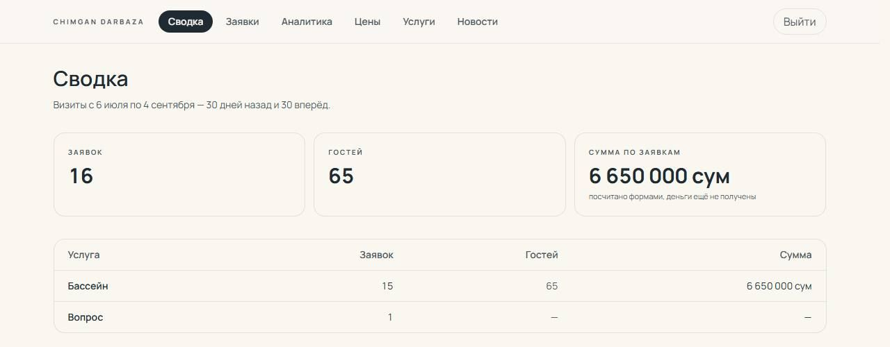
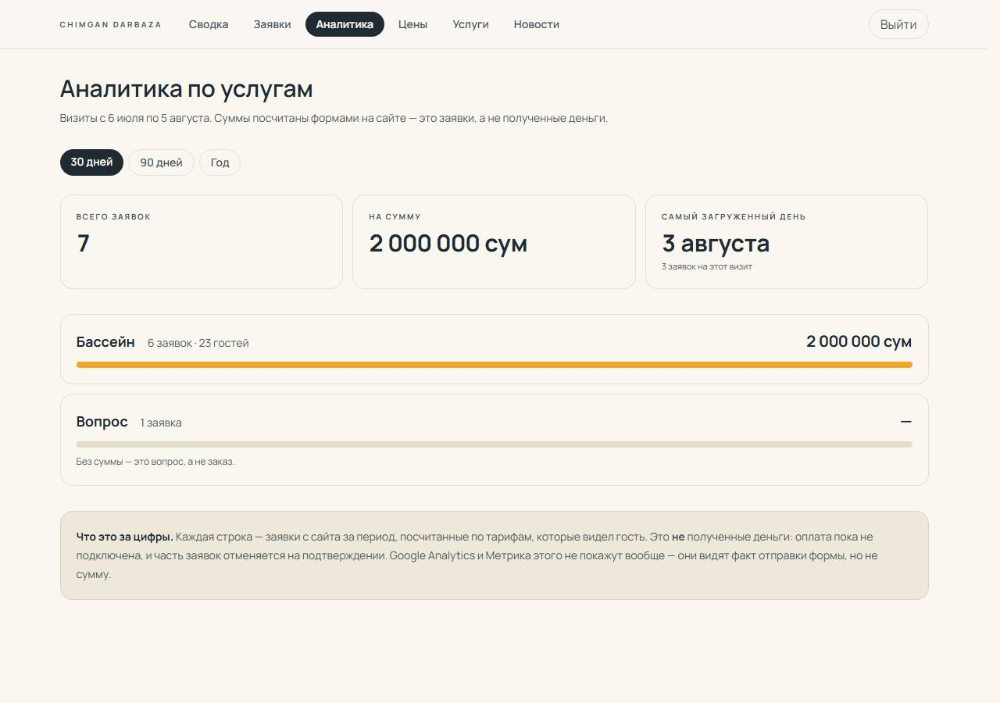
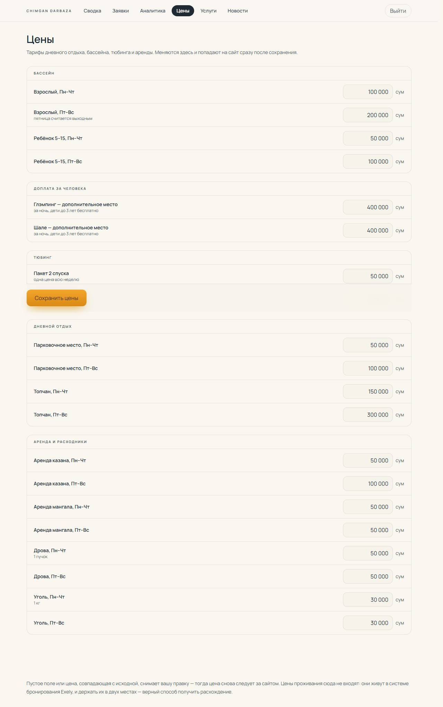

# SDS — CHIMGAN DARBAZA

**Описание устройства системы.** Сайт `chimgandarbaza.uz`.
Составлено 2026-08-05 по рабочей копии `master`. Требования — в [SRS.md](./SRS.md); здесь только то, **как** они выполнены и **почему** именно так.

Документ пишется в расчёте на человека, который откроет этот репозиторий впервые. Поэтому решения объясняются вместе с причиной: в этом коде почти каждое необычное место — след конкретной поломки.

---

## 1. Архитектура

### 1.1. Стек

| | |
|---|---|
| Фреймворк | Next.js 16, App Router |
| UI | React 19, серверные компоненты по умолчанию |
| Стили | Tailwind CSS v4, переменные бренда в `src/app/globals.css` |
| Язык | TypeScript, strict |
| Тесты | Vitest, happy-dom, 206 тестов |
| Хостинг | Vercel, проект `chimgandarbaza`, команда `manager-1855s-projects` |
| Деплой | Vercel CLI (`vercel deploy --prod`), **не** автодеплой из GitHub |

**Базы данных нет и не планируется.** Контент — TypeScript-модули, попадающие в сборку. Персистентность — объектное хранилище Vercel Blob. Это осознанный выбор для сайта, который правится редко и одним человеком: база потребовала бы миграций, резервных копий и присмотра, а даёт здесь только то, что уже даёт файл в хранилище.

### 1.2. Структура кода

```
src/
  app/
    [locale]/          все публичные страницы; ЭТОТ layout — корневой для них
    admin/             панель оператора: свой <html>, вне локалей
    actions/           серверные экшены форм
    api/               chat (консьерж), telegram/staff (вебхук), rates, images
    robots.ts, sitemap.ts
  components/
    layout/            Header, Footer, ContactForm, StickyBookingCta
    sections/          крупные блоки страниц (Hero, RoomCatalog, VideoReel…)
    ui/                атомарные виджеты (DatePicker, Lightbox, FaqPanel…)
    effects/           SnowParticles
  content/             ВСЕ данные: цены, номера, услуги, изображения, тексты
  lib/                 логика без разметки: тарифы, интеграции, хранилища
  i18n/                локали, маршрутизация, домены
  proxy.ts             перехват запросов до маршрутизации
scripts/               одноразовые и проверочные скрипты (см. §9)
docs/                  этот документ, SRS и скриншоты
```

**Корневого `src/app/layout.tsx` нет.** Корнем для публичной части служит `src/app/[locale]/layout.tsx`. Из этого следует неочевидное: любая страница вне `[locale]` обязана приносить собственные `<html>` и `<body>` — так устроена `/admin`.

---

## 2. Маршрутизация и локали

### 2.1. Механика

`src/proxy.ts` перехватывает запрос до маршрутизации. Если путь не начинается с известной локали, он переписывается в `/<локаль по умолчанию><путь>` и отдаётся редиректом 307.

Локаль по умолчанию берётся из хоста (`defaultLocaleForHost`), а не из заголовка браузера: у курорта разные домены под разные рынки, и хост — более надёжный сигнал, чем `Accept-Language` туриста в роуминге.

### 2.2. Исключения — место, где ошибались дважды

Матчер `proxy.ts` перечисляет то, что локализовать **нельзя**. Дважды выяснялось это уже на проде:

- `/admin` уезжал на `/ru/admin`, где сегмент `[locale]` пытался разобрать «admin» как язык;
- `/_vercel/insights/script.js` уезжал на `/uz/_vercel/...`, из-за чего аналитика Vercel не собрала бы ни одного события, а выглядело бы это как её собственная поломка.

**Добавляя служебное пространство имён, добавьте его в матчер.** Это не догадка — это дважды случившийся баг.

### 2.3. Стратегия рендеринга

| Что | Режим | Почему |
|---|---|---|
| Публичные страницы | пререндер (SSG) | контент из сборки, меняется деплоем |
| `/admin/*` | `force-dynamic` | читает куку сессии и живые данные |
| `/api/chat`, вебхук | динамический | по определению |
| `/api/rates` | кэш 1 час | курсы ЦБ |

**Правило: не добавляйте `export const revalidate` в сегменты публичных страниц.** Это переведёт все семь десятков пререндеренных страниц в ISR ради одного значения. Там, где нужно живое значение, используется `unstable_cache` с тегом — он кэширует **запись**, а не превращает страницу в динамическую.

---

## 3. Модель контента

### 3.1. Источники истины

Каждое число живёт **в одном месте**. Дублирование источника — то, как цены расходятся.

| Данные | Источник | Кто ещё читает |
|---|---|---|
| Цены дневного отдыха | `content/pricing.ts` | страницы, формы, оба ассистента, панель |
| Цены проживания | **Exely** | карточки, страницы, бот — живьём |
| Состав номеров | `content/rooms.ts` | каталог, страницы номеров |
| Услуги | `content/services.ts` | `/services`, главная |
| Фотографии | `content/images.ts` | всё |
| Факты для ИИ | `lib/venue-facts.ts` | оба ассистента |
| Юридические тексты | `content/policies-legal.ts` | `/legal/[slug]` |

Цены проживания **сознательно** не заведены в код: оператор меняет их в Exely, и копия здесь разошлась бы с реальностью при первом же повышении.

### 3.2. Правки оператора поверх кода

`src/lib/site-overrides.ts` — один JSON-документ в Blob по пути `site/overrides.json`:

```jsonc
{
  "version": 1,
  "updatedAt": "2026-08-05T16:20:00+05:00",
  "updatedBy": "admin",
  "data": {
    "prices": { "pool.adult.weekday": 120000 },  // только ОТЛИЧИЯ от кода
    "services": {}, "customServices": [], "news": []
  }
}
```

Три решения, каждое со следствием:

**Хранятся только отличия, а не копия каталога.** Полная копия навсегда перекрыла бы любое исправление, пришедшее с деплоем, и никто не понял бы почему. Ввод исходного значения **снимает** правку.

**Один документ, а не три.** Три — это три чтения на рендер, три etag и сохранение, способное пройти наполовину. Здесь один редактор и несколько килобайт.

**Чтение никогда не бросает исключение.** Нет токена, таймаут, битый JSON, чужая версия — всё даёт пустой патч, и сайт рисует ровно то, что в коде. Публичная страница не должна ломаться из-за хранилища, которое правит оператор.

Чтение для публичных страниц идёт через `unstable_cache` с тегом (5 минут), для панели — **всегда мимо кэша**: иначе оператор редактировал бы копию пятиминутной давности и затирал собственную правку.

---

## 4. Заявки: путь от гостя до оператора


1. Гость заполняет форму (`PoolRequestForm`, `TopchanRequestForm`, `TubingRequestForm`, `BookingRequestForm`).
2. Серверный экшен `src/app/actions/<продукт>.ts` **пересчитывает сумму сам**. Присланное клиентом значение не используется как источник — только даты, состав гостей и опции.
3. `deliverRequest()` (`src/lib/request-delivery.ts`) запускает три канала **одновременно**:

```ts
const [sent, emailOk] = await Promise.all([
  Promise.all(chatIds.map((id) => sendMessage(id, telegramHtml))),
  sendEmailCopy(subject, html),
  saveRequest(record),   // ошибки проглатывает внутри себя
]);
```

4. Гость видит успех, если сработал **хотя бы один** канал.

**Почему именно так.** В параллельном проекте `chimgan-uslugi` запись в базу и отправка в Telegram лежали в одном `try`, последовательно. Проверено исполнением: при падении базы в Telegram не уходило **ни одного** запроса, гость видел красную ошибку, оператор не получал ничего. Здесь `saveRequest()` ловит всё внутри и всегда возвращает запись — поэтому `Promise.all` не может провалиться из-за архива.

### 4.1. Архив

Vercel Blob, стор `chimgan-requests`. Схема ключа:

```
requests/<услуга>/<дата визита>/<эпоха>-<id>.json
```

Схема выбрана так, что **услуга и дата визита читаются из пути** — группировка и фильтрация стоят один вызов `list()` и ни одной загрузки тела. Загружаются только те записи, которые показываются на экране.

Записи файлируются по **дате визита**, а не подачи: вопрос оператора звучит «кто приезжает в субботу», а не «кто написал на прошлой неделе. Для курорта, где бронь приходит за недели, это совершенно разные списки.

`requestIndex()` листает **с курсором**, в отличие от старой `urlsUnder()`, которая обрывалась на тысяче записей молча — это было бы незаметно ровно до того дня, когда архив перевалит за тысячу и панель начнёт занижать цифры.

---

## 5. Бронирование проживания

Единственная интеграция, дающая живые деньги и занятость, — и она **неофициальная**: у Exely нет публичного API, поэтому `src/lib/exely.ts` вызывает тот же JSON-эндпоинт, которым пользуется их собственный виджет.

```
https://uz-ibe.hopenapi.com/ApiWebDistribution/BookingForm/hotel_availability
отель 514200; типы номеров: 5075760 глэмпинг, 5075761 шале
```

Из этого следуют два правила:
1. **Любой отказ деградирует молча.** Нет цены — нет чипа, страница работает.
2. **Изменение их бэкенда сломает разбор без предупреждения.** Форма ответа разбирается защитно.

### 5.1. Цена «от»

`src/lib/room-price.ts` опрашивает **три даты** с интервалом в две недели и берёт минимум. Это не перестраховка: 2026-08-05 ближайшие десять дней возвращали **пустоту** — занято, — и одиночный запрос дал бы вывод «цены нет».

Кэш 6 часов через `unstable_cache`. Три сетевых запроса на рендер главной недопустимы, а ночной тариф не меняется в масштабе часов.

---

## 6. ИИ-ассистенты

### 6.1. Устройство

Оба — Groq, один общий источник фактов, разные брифинги.

| | Консьерж сайта | Телеграм-бот |
|---|---|---|
| Где | `/api/chat`, панель на сайте | `@chimgandarbaza_bot` |
| Брифинг | `venueCore()` — краткий | `venueFacts()` — полный |
| Правила | `lib/ai-context.ts` | `lib/staff-ai.ts` |
| Инструменты | `check_availability`, `lookup_facts`, `get_weather` | `check_availability` |

### 6.2. Почему брифинг разделён

Консьерж отдавал `502` на **каждый** вопрос. Причина оказалась арифметической, и её видно в логе:

```
Rate limit reached ... tokens per minute (TPM): Limit 8000, Used 2129, Requested 6436
```

Бесплатный тариф даёт 8000 токенов в минуту **на аккаунт**, а один запрос просил 6436: весь свод фактов, весь свод правил и схемы инструментов — на каждое сообщение. Одного гостя хватало на минуту.

Поэтому `venueCore()` — сжатая версия (≈1000 токенов против 3555), а остальное подтягивается инструментом `lookup_facts` по шести темам: `pool`, `menu`, `directions`, `policy`, `extras`, `rooms`. Вопрос про погоду больше не оплачивает меню ресторана.

**Что нельзя вырезать из краткого брифинга ни при каких обстоятельствах — правило невозврата.** Консьерж, который его забыл, выдумывает прежнее, а прежнее обещало деньги назад.

Бот сохраняет полный брифинг: он обслуживает одного человека, и его частота запросов далека от потолка.

### 6.3. Цепочка отказов

Ключи — **внутренний** цикл, модели — внешний:

```
120b/ключ1 → 120b/ключ2 → 20b/ключ1 → 20b/ключ2 → llama/ключ1 → llama/ключ2
```

Квота считается на аккаунт, поэтому второй ключ — это **вторая квота**, а не запаска. Отсюда порядок: сменить аккаунт и сохранить хорошую модель лучше, чем сохранить аккаунт и ухудшить модель. Понижение уровня модели происходит, только когда кончились все аккаунты.

Второй проход после вызова инструмента остаётся на том ключе, который ответил на первый: результат инструмента уже получен, и гость уже подождал.

### 6.4. Наблюдаемость

Каждый вызов пишет в лог остаток квоты и раздельный расход:

```
[chat] quota openai/gpt-oss-120b: 3697/8000 tokens left this minute
[chat] usage pass1 openai/gpt-oss-120b: in=3603 out=224 total=3827
```

Без этого единственным признаком упора в потолок был `502` у гостя — именно поэтому консьерж и пролежал целый день незамеченным.

---

## 7. Панель оператора



*Кадр обрезан: ниже идёт список последних заявок с именами и телефонами гостей, которому не место в документации.*



### 7.1. Границы

`/admin` приносит собственные `<html>` и `<body>` (корневого layout у приложения нет) и **не монтирует ничего из публичной обвязки**: ни шапки, ни подвала, ни панели консьержа, ни заставки с логотипом, ни плавного скролла Lenis, ни аналитики. Каждое из них в инструменте — помеха: заставка перекрывала бы форму входа при каждом визите, Lenis боролся бы с прокруткой длинной формы, а отправлять просмотр в Метрику при редактировании цены незачем.

### 7.2. Авторизация

Кука с HMAC-подписью срока действия, `AUTH_SECRET`. В куке **нет личности** — только время истечения: подделать нельзя без секрета, а просроченную отвергает собственная метка времени.

**Проверка сессии живёт в `layout.tsx`, а не в страницах.** Пока раздел был один, разницы не было; со вторым разделом страница открыта всем, если её автор не вспомнит повторить проверку. Один барьер, который обеспечивает фреймворк, лучше шести, которые помнят люди.

**`requireAdmin()` внутри каждого серверного экшена остаётся** — это независимый второй слой. Layout не защищает экшен: экшен — публичная точка входа, доступная без единого рендера страницы.

Секунда задержки на попытку входа — не лимитер. У serverless нет общего счётчика между вызовами, и лимитер в памяти был бы бутафорией; фиксированная задержка стоит оператору секунду в день и заодно выравнивает разницу во времени между «пароль не задан» и «пароль неверный».

### 7.3. Разделы

| Раздел | Источник данных | Состояние |
|---|---|---|
| Сводка | архив заявок | готов |
| Заявки | архив заявок | готов |
| Аналитика | архив заявок | готов |
| Цены | `price-catalog.ts` + правки в Blob | готов |
| Услуги | правки в Blob | **заглушка** |
| Новости | правки в Blob | **заглушка** |

Аналитика **на самом экране** оговаривает, что суммы — это заявки, а не полученные деньги: оплаты нет, и у проживания там всегда ноль, потому что цену выставляет Exely после подтверждения. Назвать этот столбец выручкой было бы самым обманчивым, что можно показать оператору.



### 7.4. Что не редактируется и почему

- **Вместимость топчана** — делитель в расчёте (`actions/topchan.ts`); ноль дал бы `Infinity` топчанов и `Infinity` в сумме. Это факт о мебели, а не цена.
- **Количество пакетов тюбинга** — форма рендерит их по индексу, и сервер этому индексу доверяет. Цены редактируемы, состав списка — нет.
- **Цены проживания** — живут в Exely.
- **Загрузка фотографий** — на сайте нет оптимизации изображений (`next/image` не используется нигде, все фото — CSS-фоны), поэтому снимок с телефона на 6 МБ ушёл бы каждому посетителю как есть.

---

## 8. Медиа

### 8.1. Правила

**Только фотографии.** Рендеры и визуализации удалены 2026-08-04 по требованию оператора и возврату не подлежат. Кадры со строительной техникой и незавершённым благоустройством перечислены в списке исключений внизу `content/images.ts` — каждый с причиной.

**Одно фото — одна зона главной.** Правило появилось после того, как `poolPanorama` оказалась одновременно первым слайдом героя, карточкой бассейна, карточкой пикник-зоны, плиткой мозаики и кадром архива — пять мест на одной странице. Соблюдение проверяется скриптом (§9).

### 8.2. Лента под первым экраном

Два решения, оба — следствия аудита:

**Карточки задаются высотой, ширина свободна.** Раньше это был жёсткий бокс 3:2 с `object-fit: cover`, и вертикальный кадр 2200×2931 в слоте 360×240 терял 44% высоты — оставалась горизонтальная полоска через середину предмета съёмки. Подобрать горизонтальные было нечем: правило «одно фото одна зона» их разобрало. Свободная ширина решает задачу без подбора — каждый кадр приходит целиком.

**Отдельные копии по 560 px.** Лента тянула оригиналы: 5,7 МБ на декоративную полосу, которая рисуется в 250 пикселей высотой и стоит выше всего, с чем гость может что-то сделать. Стало 550 КБ.

### 8.3. Видео

Мастера с телефона и с камеры (15–260 МБ) приводятся к 720×1280 H.264 и раскладываются на три файла: полный ролик, **беззвучное превью 400 px** для карточки и постер. Карточка играет превью; полный ролик грузится только при открытии.

Это не оптимизация, а условие работоспособности: лента раньше проигрывала мастера, поэтому одновременно разрешалось играть только одному ролику, а остальные карточки стояли замороженными постерами и выглядели сломанными.

---

## 9. Проверки и скрипты

| Скрипт | Что делает | Когда запускать |
|---|---|---|
| `check-home-photos.js` | падает, если фото попало в две зоны главной или у ленты нет производной | после любой правки `images.ts` или зон |
| `make-strip-derivatives.js` | пересобирает копии для ленты | при изменении состава ленты |
| `import-photos.js`, `import-chalet-interiors.js`, `import-glamping.js` | импорт съёмок: потолок 2400 px, снятие EXIF и GPS | при получении новых фото |
| `encode-clips.js`, `encode-chalet-video.js` | видео → веб-форматы + загрузка в Blob | при получении новых роликов |
| `retouch-crane.js` | удаление строительного крана из неба на трёх кадрах | однократно; описание попыток внутри |

**Про `check-home-photos.js` отдельно.** Первая его версия читала только модули `src/content/**` и уверенно рапортовала «всё чисто», пока браузер не нашёл пять повторов: три фотозоны главная собирает **прямо в `page.tsx`**, мимо контент-файлов. Урок общий — проверка, которая смотрит не туда, куда смотрит браузер, хуже отсутствия проверки.

---

## 10. Сборка, деплой, конфигурация

```powershell
# Проверки (в этом порядке)
& 'C:\Program Files\nodejs\node.exe' .\node_modules\typescript\bin\tsc --noEmit
& 'C:\Program Files\nodejs\node.exe' .\node_modules\vitest\vitest.mjs run
& 'C:\Program Files\nodejs\node.exe' .\scripts\check-home-photos.js
& 'C:\Program Files\nodejs\node.exe' .\node_modules\next\dist\bin\next build

# Деплой
vercel deploy --prod --yes --scope <team>
```

**Push в GitHub не деплоит.** Связь с репозиторием не восстановлена после переезда на аккаунт `manager@`; прод обновляется только командой CLI.

### 10.1. Переменные окружения

| Переменная | Назначение | Без неё |
|---|---|---|
| `BLOB_READ_WRITE_TOKEN` | архив, видео, правки | заявка доходит, но не архивируется |
| `TELEGRAM_ADMIN_CHAT_ID` | куда падают заявки | в лог пишется ошибка, остальные каналы работают |
| `TELEGRAM_STAFF_BOT_TOKEN` | гостевой бот | бот не отвечает |
| `TELEGRAM_WEBHOOK_SECRET` | подпись вебхука | вебхук отклоняет запросы |
| `RESEND_API_KEY`, `BOOKING_EMAIL_FROM`, `RESERVATIONS_EMAIL_TO`, `INFO_EMAIL_TO` | почта | копия не уходит |
| `GROQ_API_KEY`, `GROQ_API_KEY_2` | ассистенты; **две независимые квоты** | при отсутствии обоих — «позвоните нам» |
| `EXELY_API_BASE`, `EXELY_API_KEY` | PMS | цены «от» не показываются |
| `AUTH_SECRET`, `ADMIN_PASSWORD` | панель | вход закрыт с объяснением |
| `NEXT_PUBLIC_GA4_ID` | аналитика Google | берётся значение из кода |
| `NEXT_PUBLIC_YANDEX_METRICA_ID` | Метрика | счётчик не выводится |
| `NEXT_PUBLIC_GOOGLE_MAPS_API_KEY` | карта на контактах | карта не грузится |

Переменные, помеченные в Vercel как sensitive, **не читаются обратно** — `vercel env pull` возвращает их пустыми. Это регулярно вводит в заблуждение: пустое значение в выгрузке не означает, что переменная не задана.

---

## 11. Ловушки

Собрано отдельно, потому что каждая уже стоила времени.

1. **Неразрывный пробел в ценах.** `money()` разделяет разряды **U+00A0**, чтобы «100 000» не переносилось как «100» / «000» в узкой колонке. Следствие: `grep "100 000"` с обычным пробелом **не находит** эти строки. Ищите по `000`.

2. **Git Bash калечит кириллицу и обратные слэши** в аргументах `-e` и в heredoc. Скрипты с русским текстом или регулярками пишите файлом.

3. **`tsc` может прочитать файл в момент записи** и выдать ошибки о пропавших определениях. Перезапустите, прежде чем чинить.

4. **Устаревший `next start` переживает сессию.** Проверка «на локальном сервере» дважды показывала прошлую сборку. Убивайте процессы node или берите свежий порт.

5. **`revalidateTag` в Next 16 требует второй аргумент** — профиль кэша.

6. **Серверный компонент не принимает обработчики.** `onError` на `` в серверном компоненте не скомпилируется; для этого нужен клиентский компонент или проверка на этапе сборки.

7. **`.img-reveal-wrapper` перекрывает фото шторкой**, пока `IntersectionObserver` не добавит `is-visible`. Скриншот, снятый без прокрутки, покажет пустой прямоугольник — это артефакт съёмки, а не поломка.

---

## 12. Технический долг

| Пункт | Почему важно |
|---|---|
| Галочка согласия с офертой в формах | гость соглашается с невозвратной предоплатой, не подтверждая этого |
| Разделы «Услуги» и «Новости» | оператор не может добавить услугу или новость без разработчика |
| Публичная страница новостей | публиковать некуда |
| Правила `ai-context.ts` (~2000 токенов) | следующая по величине статья расхода на каждый вопрос |
| Условия отмены дневных услуг | расходятся с проживанием; ассистенты обходят тему |
| `assistant-knowledge.ts` | мёртвый файл, помечен, но не удалён |
| Оплата Payme | все суммы в системе расчётные |
