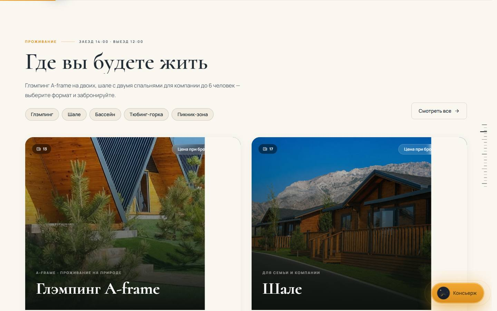
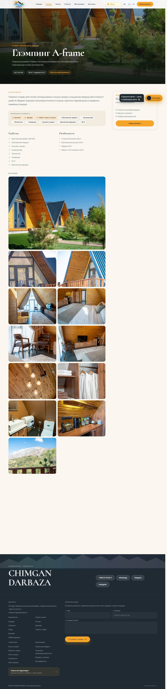
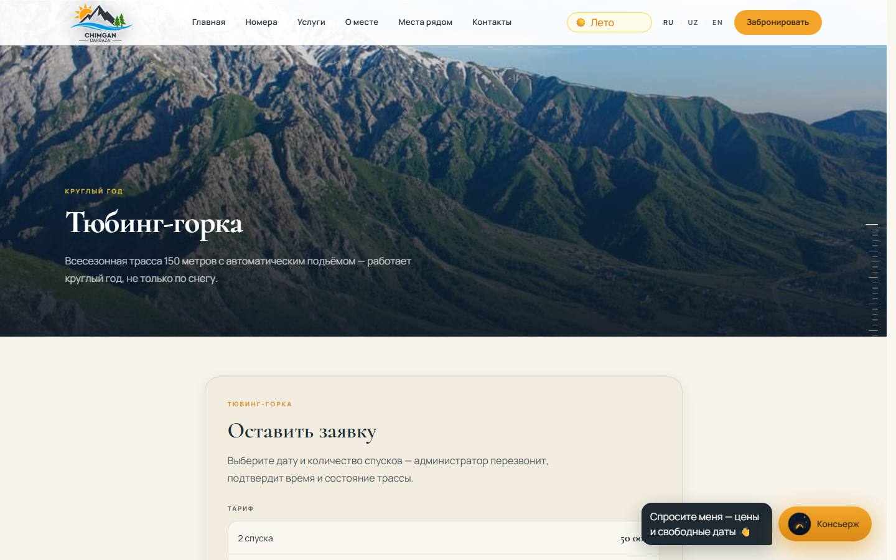
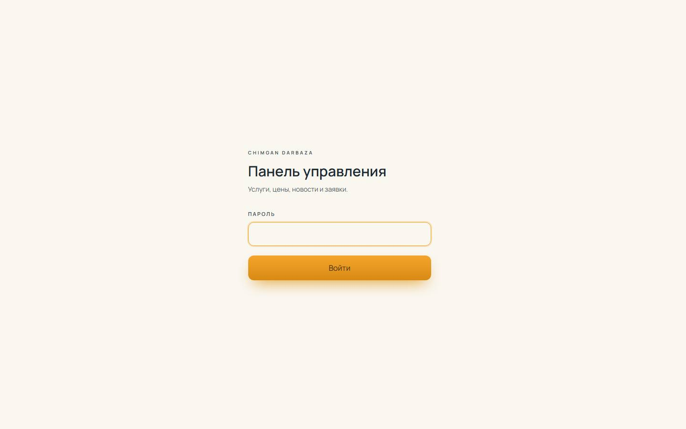

# SRS — CHIMGAN DARBAZA

**Спецификация требований к системе.** Сайт `chimgandarbaza.uz`.
Составлено 2026-08-05 по рабочей копии `master`. Все утверждения проверены по коду или измерены на живом сайте; там, где что-то не проверено, это сказано прямо.

---

## 1. Введение

### 1.1. Назначение

Документ фиксирует, **что** система должна делать. Устройство — как именно она это делает — в [SDS.md](./SDS.md).

Требования пронумерованы: `FR-<подсистема>-<n>` для функциональных, `NFR-<n>` для нефункциональных. У каждого указан способ проверки, потому что требование, которое нельзя проверить, — это пожелание.

### 1.2. Что это за система

Сайт горного курорта в Бостанлыкском районе Ташкентской области: 45 минут езды от Ташкента, высота 1700 м, 9 гектаров, 20 домиков (10 шале и 10 глэмпингов A-frame). Работает круглый год.

Сайт продаёт **два разных формата**, и это разделение проходит через всю систему:

| | Проживание | Дневной отдых |
|---|---|---|
| Что | глэмпинг A-frame, шале | бассейн, топчан, тюбинг |
| Как бронируется | движок Exely, онлайн | форма заявки, администратор перезванивает |
| Откуда цена | из Exely, живая | фиксированный прайс в коде |
| Оплата | предоплата 50% | по договорённости |

### 1.3. Роли

- **Гость** — анонимный посетитель сайта и телеграм-бота.
- **Оператор** — один человек, владелец. Работает через `/admin` и телеграм-бота.
- **Разработчик** — вносит изменения в код и деплоит.

Учётных записей гостей нет. Регистрации нет. Персональные данные собираются только в момент отправки заявки.

### 1.4. Определения

- **Топчан** — традиционная деревянная платформа с курпачами под навесом, сдаётся целиком, до 8 гостей.
- **Спуск** — один проезд по тюбинг-горке. Продаётся пакетами по 2 и 4. *(Не «прокатка» — терминология исправлена оператором 2026-08-05.)*
- **Шахматка** — сетка занятости номеров в системе бронирования.
- **Exely** — PMS и движок бронирования, через который продаётся проживание.

---

## 2. Общее описание

### 2.1. Контекст

Система — статический сайт с несколькими динамическими точками. **Базы данных нет.** Весь контент живёт в TypeScript-модулях `src/content/*.ts` и попадает в сборку; изменение контента — это коммит и деплой, за исключением того, что оператор меняет через `/admin` (см. `FR-ADM-*`).

### 2.2. Ограничения среды

- Хостинг Vercel, serverless. Между запросами состояние не сохраняется: любой счётчик, лимитер или сессия, живущие в памяти, не переживают запрос.
- Три локали: `ru`, `uz`, `en`. **URL без префикса локали не существует** — `/` редиректится на `/ru`.
- Бесплатный тариф Groq: **8000 токенов в минуту на аккаунт**. Один вопрос гостя стоит ≈3800 токенов (измерено). Это жёсткая граница пропускной способности ИИ.

---

## 3. Функциональные требования

### 3.1. Маршрутизация и локализация — `FR-LOC`

| ID | Требование | Проверка |
|---|---|---|
| FR-LOC-1 | Любой публичный URL без префикса локали редиректится (307) на тот же путь с локалью по умолчанию | `curl -I https://chimgandarbaza.uz/nomera` → 307 на `/ru/nomera` |
| FR-LOC-2 | Локаль по умолчанию определяется по хосту | `src/i18n/domains.ts`, `defaultLocaleForHost()` |
| FR-LOC-3 | Служебные пространства имён **не** локализуются: `_next`, `_vercel`, `api`, `admin`, `images`, `robots.txt`, `sitemap.xml`, файлы подтверждения | `src/proxy.ts`, матчер |
| FR-LOC-4 | Неизвестная локаль в пути отдаёт 404, а не подставляет русскую | `/xx/nomera` → 404 |
| FR-LOC-5 | Каждая страница объявляет `hreflang` для всех трёх локалей | исходный код страницы, `<link rel="alternate">` |

> `FR-LOC-3` — не косметика. Дважды за разработку сюда попадали служебные адреса: `/admin` уезжал на `/ru/admin`, а `/_vercel/insights/script.js` — на `/uz/_vercel/...`, из-за чего аналитика Vercel не собрала бы ничего и это выглядело бы как её поломка.

### 3.2. Проживание — `FR-STAY`

| ID | Требование | Проверка |
|---|---|---|
| FR-STAY-1 | Каталог показывает только построенное и бронируемое; `available: false` скрывает номер и его страницу | `/nomera/<скрытый>` → 404 |
| FR-STAY-2 | Карточка показывает вместимость, площадь и цену «от» | визуально |
| FR-STAY-3 | Цена «от» берётся **живой из Exely**, а не из кода | `src/lib/room-price.ts`; при недоступности движка чипа нет |
| FR-STAY-4 | Цена показана в четырёх местах согласованно: чип карточки, чип в шапке страницы, панель брони, главная | все четыре читают один источник |
| FR-STAY-5 | Кнопка брони ведёт в Exely с предвыбранным типом номера | `?room-type=<id>`, `EXELY_ROOM_TYPE` |
| FR-STAY-6 | Страница номера показывает состав, удобства, галерею и видео | визуально |
| FR-STAY-7 | Доплата за дополнительное место указана рядом с тем, что включено | 400 000 сум/чел./ночь, дети до 3 лет бесплатно |

### 3.3. Дневные продукты — `FR-DAY`

| ID | Требование | Проверка |
|---|---|---|
| FR-DAY-1 | У бассейна, топчана и тюбинга своя страница и своя форма | `/nomera/pool`, `/topchan`, `/tubing` |
| FR-DAY-2 | Стоимость считается **на сервере**, ввод клиента не является источником суммы | серверные экшены `src/app/actions/*` |
| FR-DAY-3 | Пятница считается выходным днём во всех тарифах | `isWeekendISO()` — сб, вс, пт |
| FR-DAY-4 | Топчан тарифицируется за платформу целиком, а не с человека; при большем числе гостей берётся несколько платформ | расчёт делит гостей на вместимость |
| FR-DAY-5 | Платная парковка только у гостей тюбинга | не упоминается в ответах про бассейн, топчан и проживание |

### 3.4. Заявки — `FR-REQ`

| ID | Требование | Проверка |
|---|---|---|
| FR-REQ-1 | Заявка уходит в Telegram, на почту и в архив **одновременно**, не последовательно | `deliverRequest()`, `Promise.all` |
| FR-REQ-2 | Отказ архива **не может** отменить доставку в Telegram | `saveRequest()` ловит всё и всегда возвращает запись |
| FR-REQ-3 | Гость видит успех, если сработал хотя бы один канал | серверный экшен возвращает статус каждого |
| FR-REQ-4 | Заявки на проживание и вопросы уходят на разные почтовые ящики | скрытое поле `formType` |
| FR-REQ-5 | Телефон нормализуется в международный формат для кликабельного звонка | `dialable()` |
| FR-REQ-6 | Каждая заявка архивируется с услугой, датой визита, составом гостей и суммой | Vercel Blob |

> `FR-REQ-2` — это не теория. В параллельном проекте `chimgan-uslugi` запись в базу и отправка в Telegram лежали в одном `try`, и падение базы означало **потерю заявки целиком**: гость видел ошибку, оператор не получал ничего. Здесь порядок другой по построению.

### 3.5. ИИ-ассистенты — `FR-AI`

Их два, и оба читают факты из одного файла, чтобы не расходиться.

| ID | Требование | Проверка |
|---|---|---|
| FR-AI-1 | Консьерж на сайте отвечает на языке гостя; кириллица → русский | правила в `ai-context.ts` |
| FR-AI-2 | Живые цены и занятость проживания — **только** инструментом из Exely, никогда по памяти | `check_availability` |
| FR-AI-3 | Фиксированные цены дневного отдыха ассистент называет сам, инструмент для них не вызывает | описание инструмента запрещает явно |
| FR-AI-4 | Погоду ассистент называет только по данным инструмента | `get_weather` |
| FR-AI-5 | Подробности вне краткого брифинга подтягиваются инструментом, а не заменяются отпиской «уточните у администратора» | `lookup_facts`, 6 тем |
| FR-AI-6 | Ассистент **не обещает возврата денег** за проживание и не называет процентов и шкал | брифинг, раздел «Отмена и перенос» |
| FR-AI-7 | По отмене дневных услуг ассистент не называет никаких сроков и сумм, а адресует администратору | брифинг |
| FR-AI-8 | Ассистент никогда не упоминает `/admin` гостю | брифинг |
| FR-AI-9 | При исчерпании квоты система меняет **аккаунт**, а не модель | цепочка перебора: ключи внутри, модели снаружи |

### 3.6. Telegram-бот — `FR-BOT`

Гостевой бот `@chimgandarbaza_bot`. Персонала, занятости и финансов не показывает.

| ID | Требование | Проверка |
|---|---|---|
| FR-BOT-1 | Меню: ИИ-помощник, свободные даты и цены, онлайн-бронирование, цены дня, погода, фото, контакты, журнал заявок | `/start` |
| FR-BOT-2 | Живые цены за две нажатия: выбор даты → цены из Exely | `renderPriceFor()` |
| FR-BOT-3 | Состояние переносится в `callback_data`, хранилища сессий нет | требование serverless-среды |
| FR-BOT-4 | В личных чатах владельца бот отвечает **только ночью** (23:00–08:00) | днём оператор отвечает сам |
| FR-BOT-5 | Пометку «отвечает бот» бот ставит раз в разговор за 6 часов, а не под каждым сообщением | `needsNightNote()` |

### 3.7. Панель оператора — `FR-ADM`

| ID | Требование | Проверка |
|---|---|---|
| FR-ADM-1 | `/admin` закрыт паролем; без сессии ни один раздел не отдаёт содержимого | проверено на проде для всех разделов |
| FR-ADM-2 | Проверка сессии — в layout, а не в страницах | новая страница не может её забыть |
| FR-ADM-3 | Каждый серверный экшен проверяет сессию **независимо** | экшен — публичная точка входа, layout его не защищает |
| FR-ADM-4 | Сессия — HMAC-подписанная кука, HttpOnly + Secure + SameSite=Lax, срок 12 часов | проверено на проде |
| FR-ADM-5 | Отсутствие `AUTH_SECRET` закрывает вход, а не открывает | тест «fails closed» |
| FR-ADM-6 | Сводка показывает заявки и гостей за 60 дней по **дате визита** | `/admin` |
| FR-ADM-7 | Журнал показывает все заявки с фильтром по периоду и услуге | `/admin/zayavki` |
| FR-ADM-8 | Аналитика показывает разбивку по услугам и **явно оговаривает**, что суммы — это заявки, а не полученные деньги | `/admin/analitika` |
| FR-ADM-9 | Цены редактируются и попадают на сайт сразу после сохранения | `/admin/tseny` |
| FR-ADM-10 | В хранилище пишутся **только отличия** от кода; ввод исходного значения снимает правку | иначе будущее исправление в коде было бы навсегда перекрыто |
| FR-ADM-11 | Вместимость топчана и цены проживания **не редактируются** | делитель в расчёте; второй источник истины |
| FR-ADM-12 | `/admin` запрещён в `robots.txt` и помечен `noindex` | `curl /robots.txt` |
| FR-ADM-13 | Разделы «Услуги» и «Новости» — заглушки, честно объясняющие, что будет | *не реализовано* |

### 3.8. Фотоматериалы — `FR-IMG`

| ID | Требование | Проверка |
|---|---|---|
| FR-IMG-1 | На сайте нет визуализаций и рендеров — только фотографии | правило оператора, 2026-08-04 |
| FR-IMG-2 | Не публикуются кадры со строительной техникой и незавершённым благоустройством | список исключений в `images.ts` |
| FR-IMG-3 | **Ни одно фото не появляется дважды на главной** | `scripts/check-home-photos.js`, падает при повторе |
| FR-IMG-4 | Ни одна страница не показывает одно фото дважды | архив исключает показанное выше |
| FR-IMG-5 | Кадр не обрезается так, чтобы терялся предмет съёмки | аудит: 0 обрезок |
| FR-IMG-6 | У каждого фото есть альтернативный текст на трёх языках | `images.ts`, поле `alt` |

---

## 4. Бизнес-правила — `BR`

Это раздел, ради которого документ существует: числа и правила, которые система обязана соблюдать.

### 4.1. Тарифы дневного отдыха

Пн–Чт / Пт–Вс, в сумах. **Пятница — выходной тариф.**

| Позиция | Будни | Выходные | Единица |
|---|---:|---:|---|
| Бассейн, взрослый и от 15 лет | 100 000 | 200 000 | с человека |
| Бассейн, ребёнок 5–15 | 50 000 | 100 000 | с человека |
| Бассейн, до 5 лет | 0 | 0 | со взрослым |
| Топчан | 150 000 | 300 000 | за платформу, до 8 гостей |
| Тюбинг, 2 спуска | 50 000 | 50 000 | за пакет |
| Тюбинг, 4 спуска | 100 000 | 100 000 | за пакет |
| Парковка (только тюбинг) | 50 000 | 100 000 | за автомобиль |
| Аренда казана | 50 000 | 100 000 | |
| Аренда мангала | 50 000 | 50 000 | |
| Дрова | 50 000 | 50 000 | пучок |
| Уголь | 30 000 | 30 000 | кг |

Дополнительно: полотенце 30 000; бунгало до 4 человек 300 000; бунгало до 10 человек 500 000. **Аренда бунгало не включает входные билеты.**

### 4.2. Проживание

| Правило | Значение |
|---|---|
| Заезд / выезд | с 14:00 / до 12:00, ресепшн круглосуточно |
| Глэмпинг A-frame | до 3 гостей, 28 м² + терраса 15 м², от 1 500 000 сум/ночь |
| Шале | до 6 гостей, 2 спальни со своими санузлами, терраса 35 м², от 3 000 000 сум/ночь |
| Дополнительное место | 400 000 сум с человека за ночь; дети до 3 лет бесплатно |
| Включено | завтрак, бассейн, тюбинг (2 спуска глэмпингу, 4 шале), парковка, Wi-Fi |
| Депозит при заселении | 500 000 сум за домик, **возвратный** |
| Предоплата | 50% в течение 24 часов после подтверждения |

### 4.3. Отмена и перенос

**Изменено оператором 2026-08-05. Прежняя шкала (100% / 50% / 0%) больше не действует для проживания.**

| Случай | Правило |
|---|---|
| Отмена проживания гостем | **Предоплата невозвратная.** Возврата нет ни при каком сроке уведомления |
| Единственная альтернатива | Перенос дат, согласовывается администратором при наличии мест |
| Неявка на проживание | Предоплата не возвращается, перенос не предоставляется |
| Отмена дневных услуг | **Не изменялась.** Условия §2 и §6.2.1 оферты остаются в силе |
| Форс-мажор | Не затронут: перенос или полный возврат |
| Вина исполнителя | Не затронута: полный возврат стоимости неоказанной услуги |

> Область изменения ограничена сознательно. Формулировка оператора заменяет шкалу, выраженную в сутках до **заезда**, — это шкала проживания. У дневных услуг отдельное правило (24 часа), о котором оператор не говорил, и удаление опубликованной гарантии, которую никто не просил удалять, было бы выдумыванием условий.

### 4.4. Правила пребывания

| Правило | Значение |
|---|---|
| Животные | **Полный запрет** на проживание с животными и на вход на территорию. Исключений нет |
| Своя еда | Можно на топчан и в пикник-зону; **нельзя в зону бассейна** |
| Свой мангал | Можно, при соблюдении норм безопасности |
| Цены на блюда | На сайте не публикуются; ассистенты не имеют права называть сумму |

### 4.5. Согласие с офертой

Перед отправкой заявки гость подтверждает:

> «Я ознакомлен и согласен с условиями Публичной оферты, в том числе с политикой невозвратности предоплаты (только перенос дат) и полным запретом на проживание с животными»

**Статус: не реализовано как галочка в формах.** Текст внесён в оферту и в брифинги ассистентов; обязательное поле в формах с серверной проверкой — в работе.

---

## 5. Внешние интерфейсы — `FR-INT`

| Система | Назначение | Поведение при отказе |
|---|---|---|
| **Exely** (`uz-ibe.hopenapi.com`, отель 514200) | живые цены и занятость проживания | цена «от» не показывается, страница работает |
| **Telegram Bot API** | доставка заявок, гостевой бот | заявка идёт по остальным каналам |
| **Resend** | копия заявки на почту | заявка идёт в Telegram и в архив |
| **Vercel Blob** | архив заявок, видео, правки оператора | заявка доходит, но не архивируется; сайт показывает контент из кода |
| **Groq** (2 аккаунта) | оба ассистента | смена аккаунта, затем модели; далее — «позвоните нам» |
| **open-meteo** | погода | ассистент честно говорит, что данных нет |
| **ЦБ РУз** | курсы валют | отдаётся запасное значение |
| **GA4** `G-9P44JZ0828` | аналитика | — |
| **Яндекс.Метрика** `111294737` | аналитика, вебвизор, карта кликов | — |

> Интеграция с Exely **неофициальная**: у них нет публичного API, вызывается тот же JSON-эндпоинт, которым пользуется их собственный виджет. Изменение их бэкенда сломает получение цен без предупреждения — отсюда требование к деградации.

---

## 6. Нефункциональные требования

| ID | Требование | Проверка |
|---|---|---|
| NFR-1 | Отказ любой внешней системы не делает публичную страницу нерабочей | каждая интеграция имеет ветку деградации |
| NFR-2 | Фотополоса под первым экраном весит не более 1 МБ | измерено: 550 КБ |
| NFR-3 | Мобильные страницы не двигают фотографии сами по себе | ротация героя, лента и параллакс отключены ниже 1024 px |
| NFR-4 | Первый экран не исчезает и не затемняется при скролле | измерено: прозрачность 1.0, зазор 0 px |
| NFR-5 | Все формы работают без JavaScript в части отправки | серверные экшены |
| NFR-6 | Пароль администратора сравнивается за постоянное время | `timingSafeEqual` |
| NFR-7 | Каждая попытка входа занимает фиксированную секунду | у serverless нет общего счётчика, лимитер в памяти — бутафория |
| NFR-8 | Секреты не попадают в клиентский бандл и в репозиторий | только серверные модули; `.env*` в `.gitignore` |
| NFR-9 | Заголовки безопасности выставлены на все маршруты | `next.config.ts`: nosniff, HSTS, X-Frame-Options, Permissions-Policy |
| NFR-10 | Тесты проходят перед каждым деплоем | 206 тестов |
| NFR-11 | Остаток квоты ИИ виден в логах на каждый вызов | иначе упор в потолок обнаруживается только по жалобе гостя |
| NFR-12 | Три локали говорят **одно и то же** об условиях и ценах | требование юридическое, а не редакторское |

---

## 7. Что в систему не входит

Перечислено, чтобы не считать отсутствующее недоделанным.

- **Онлайн-оплаты нет.** Payme ожидается, ключей мерчанта нет. Все суммы в системе — расчётные, не полученные.
- **Учётных записей гостей нет.** Истории броней, личного кабинета, авторизации гостя.
- **Базы данных нет.** Хранилище — файлы в объектном хранилище.
- **Загрузки изображений оператором нет.** Фото выбираются из уже опубликованных: на сайте нет оптимизации изображений, и снимок с телефона ушёл бы каждому посетителю как есть.
- **Управления занятостью нет.** Шахматка живёт в Exely, сайт её только читает.
- **Мультивалютности нет.** Цены в сумах; виджет курсов — справочный.

---

## 8. Известные проблемы

| Проблема | Влияние | Статус |
|---|---|---|
| Потолок Groq 8000 токенов/мин на аккаунт | ≈2 вопроса в минуту на аккаунт; при всплеске гость получает отказ | смягчено: брифинг сжат на 72%, подключён второй аккаунт. Радикально — платный тариф |
| Галочка согласия с офертой | Гость соглашается с условиями, не подтверждая этого явно | в работе |
| Разделы «Услуги» и «Новости» в панели | Оператор не может добавить услугу или новость сам | в работе, хранилище готово |
| Публичного раздела новостей нет | Некуда публиковать | в работе |
| Условия отмены дневных услуг | Расходятся с проживанием; ассистенты обходят тему | **ждёт решения оператора** |
| Срок и число переносов дат | Для проживания не ограничены; формально бронь можно двигать бесконечно | **ждёт решения оператора** |
| Мини-футбол и детская площадка | Построены, но на сайте отсутствуют — ни текста, ни фотографий | ждёт материалов |
| Нет фотографий ресторана | Карточку кухни занимает стоковое фото блюда | ждёт съёмки |
| Журнал заявок в боте открыт всем | Имена и телефоны гостей доступны любому, кто открыл бота | **сознательное решение оператора** |
